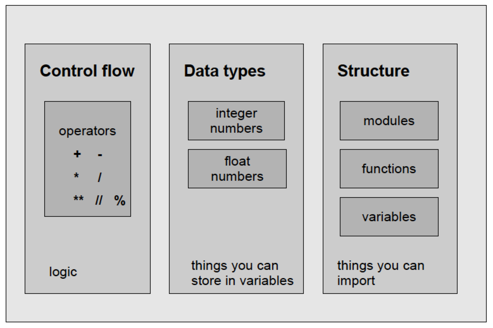
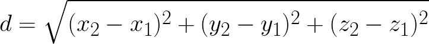

<a href="https://github.com/Pfern/BPBR16-Bioinformatics-using-Python-for-Biomedical-Researchers#this-repository-is-for-the-course-materials-and-it-is-organized-as-follows"> Back to Timetable</a>


# The Python Shell

In this module you can learn:
+ How to use Python as a pocket calculator
+ How to store data in variables
+  How to import functions from Python modules


### Traces in the desert sand…


Fill in dashed lines with appropriate values using the python interactive shell

```
>>> 1 _ _ 2
>>> 3
>>> 12 - _ _
4
>>> _ _ * 5
20
>>> _ _ ** 2
81
```

```
>>> camels = 9
>>> camels
_ _
>>> silk = camels *  _ _
>> silk
36
>>> math.sqrt(silk)
_ _
>>> math.pow(camels, _ _ )
81.0
```


### The interactive Python shell
You can access the shell by typing `python` in a command-line terminal

```
$ python
Python 2.7.9 (default, Apr  2 2015, 15:33:21)
[GCC 4.9.2] on linux2
Type "help", "copyright", "credits" or "license" for more information.
>>>
```

You can leave the shell with  `Ctrl-D`


---
> **Challenge #1**
> Open a Python interactive session (the Python shell):
>
>+  Calculate the sum and difference of two
numbers
>+  Divide two numbers. Try 5/3.
>+ Then try 5.0/3
>+  Calculate 3x5
>+  Calculate a power of 2
>
----

<br>
<br>

### Variables
Variables are containers for data.

Variable names may be composed of letters, underscores and, after the first position, also digits.

```
>>> camels = 9
>>> camels
9
>>> silk = camels * 4
>> silk
36
```

### The math module

 Sometimes you need more complex mathematical constants and functions

+  square root
+  factorial
+  sine or cosine
+  pi
+  log

Python groups them together in a text file. You can access them by importing the file.
```
import math
```

Find the matching pairs of functions and x/y values.


### Components of Python



### Recap

### The Dogma of Programming

+ First, make it work.
+ Second, make it nice.
+ Third, and only if it is really necessary,
make it fast.

<br>
> **Challenge #2**
---
>+   The diameter of a cell is 10 μm.
>+ What volume does that cell have given it is a perfect sphere?
>+  Use Python to do the calculation.
>+  Use variables for the parameters.
>+  Print the volume to the screen
>
---


See the <a href="https://github.com/Pfern/BPBR16-Bioinformatics-using-Python-for-Biomedical-Researchers/blob/master/day1/2-Pythonshell/pythonshell.solutions.md#solution-to-challenge-2">Solution to challenge #2</a>
<br>
<br>


> **Challenge #3**<br>
---
>Calculate the distance between two points in the 3D space
>
>Given two points in the Cartesian space:
>
>P1 = (43.64, 30.72, 88.95)
>P2 = (45.83, 31.11, 92.04)
>
>+  Use Python to calculate their distance
>+   Use variables for the parameters
>+   Print the distance to the screen
>
>The  formula for  calculating the distance is:
> 
>
---


See the <a href="https://github.com/Pfern/BPBR16-Bioinformatics-using-Python-for-Biomedical-Researchers/blob/master/day1/2-Pythonshell/pythonshell.solutions.md#solution-to-challenge-3">Solution to challenge #3</a>
<br>
<br>


> **Challenge #4**<br>
---
>Find cysteine bonds in the Insulin structure
>
>+   Data in 2OMH.pdb
>+   Lines containing 'SG'
>+   x, y, z coordinates
>+   Use what you learnt from Task 2
>
---


```
HEADER    HORMONE                                 22-JAN-07   2OMH
TITLE     STRUCTURE OF HUMAN INSULIN COCRYSTALLIZED WITH ARG-12 PEPTIDE IN
TITLE    2 PRESENCE OF UREA
COMPND    MOL_ID: 1;
COMPND   2 MOLECULE: INSULIN A CHAIN;
COMPND   3 CHAIN: A
COMPND   4 MOL_ID: 2;
COMPND   5 MOLECULE: INSULIN B CHAIN;
COMPND   6 CHAIN: B
ATOM      1  N   GLY A   1     -11.626  14.280   1.013  1.00 19.13           N  
ATOM      2  CA  GLY A   1     -12.164  13.430   2.116  1.00 18.24           C  
ATOM      3  C   GLY A   1     -11.587  13.815   3.470  1.00 17.90           C  
ATOM      4  O   GLY A   1     -10.907  14.833   3.590  1.00 18.08           O  
ATOM      5  N   ILE A   2     -11.836  12.995   4.484  1.00 17.57           N  
ATOM      6  CA  ILE A   2     -11.397  13.317   5.832  1.00 17.78           C  
ATOM      7  C   ILE A   2      -9.875  13.489   5.951  1.00 17.93           C  
ATOM      8  O   ILE A   2      -9.408  14.371   6.670  1.00 17.80           O  
ATOM      9  CB  ILE A   2     -11.922  12.289   6.869  1.00 17.86           C  
ATOM     10  CG1 ILE A   2     -11.767  12.855   8.281  1.00 17.66           C  
ATOM     11  CG2 ILE A   2     -11.242  10.918   6.680  1.00 18.86           C  
ATOM     12  CD1 ILE A   2     -12.434  12.031   9.365  1.00 19.10           C  
ATOM     13  N   VAL A   3      -9.110  12.680   5.224  1.00 18.04           N  
ATOM     14  CA  VAL A   3      -7.652  12.759   5.315  1.00 19.40           C  
ATOM     15  C   VAL A   3      -7.193  14.102   4.747  1.00 19.43           C  
ATOM     16  O   VAL A   3      -6.395  14.820   5.357  1.00 19.23           O
```

> **Challenge #5**<br>
---
>The hydrolysis of one phosphodiester bond from ATP results in a standard Gibbs energy (ΔG<sup>0</sup>) of -30.5 kJ/mol. According to biochemistry textbooks, the real ΔG value depends on the concentration of the compounds and these concentrations can differ quite a lot among tissues.
>
>The Gibbs energy as a function of the concentrations of the compounds can be written as:
>
>ΔG = ΔG<sup>0</sup>  + RT \* ln ( [ADP] * [Pi] / [ATP])
>
>Knowing that:
>
>R = 0.00831
>
>T = 298
>
>+  Use Python to calculate the real DG in the tissues reported in the table.
>+  Use variables for the parameters.
>+  Print the results to the screen.
>
---


See the <a href="https://github.com/Pfern/BPBR16-Bioinformatics-using-Python-for-Biomedical-Researchers/blob/master/day1/2-Pythonshell/pythonshell.solutions.md#solution-to-challenge-5">Solution to challenge #5</a>


### Recap

+  You can use the Python shell as a pocket
calculator.
+  Variables are containers for data.
+  Modules are containers for data and functions
+  You can leave the shell by Ctrl-D.
