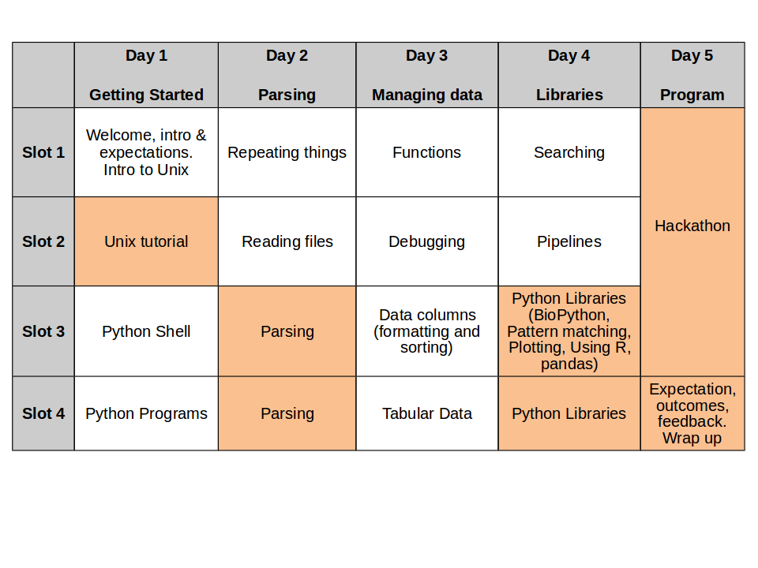
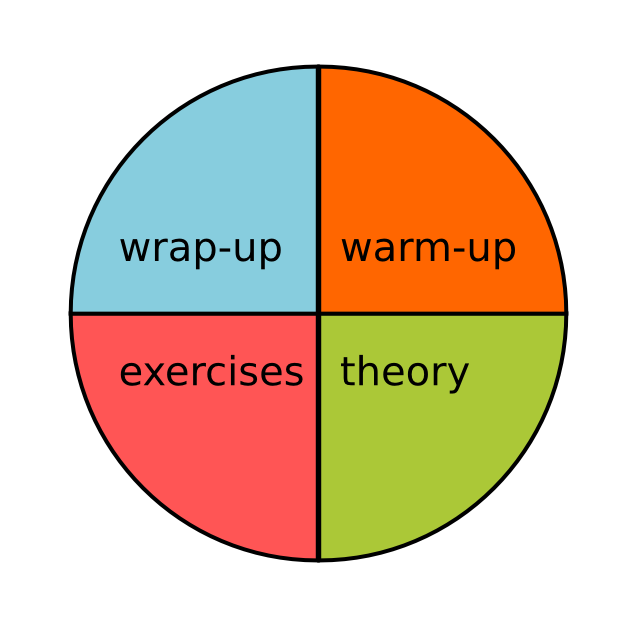

<a href="https://github.com/joanamarques/python_course"> Back to Timetable</a>

### In this course you will learn to:

+ Read text files (and websites)
+ Selectively extract and manipulate information
+ Manage tabular data
+ Manage sequence data
+ Combine programs to pipelines
+ Use libraries
+ PROGRAM!

*At the end of this course you won’t be expert programmers, but “high level beginners”*

Therefore your future as programmers strongly depends on your will to not stop programming when you go back home

*Secret: Having problems the solution of which requires programming*

### We need your help to:

+ start sessions
+ end sessions (recap and feedback)
+ collect feedback
+ write stuff and pin them on the pin board
+ discuss exercise solutions
+ teach

# Getting started

####  Why are we here?
#### What are your expectations?

---
Challenge

> What do you need programming for?
> What would you like to take home from the course?
>
Write on a card
>
>Finish within 7 minutes
>
---

## How is going to work

Each slot is organised as follows:

