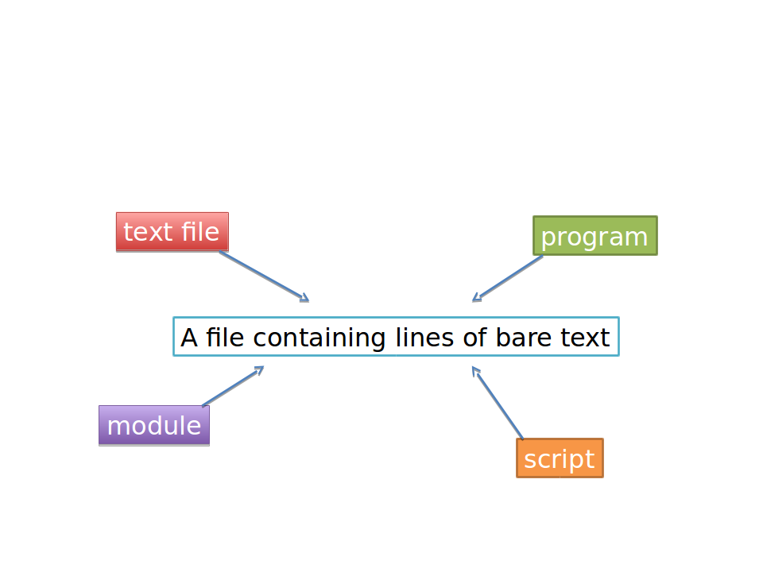
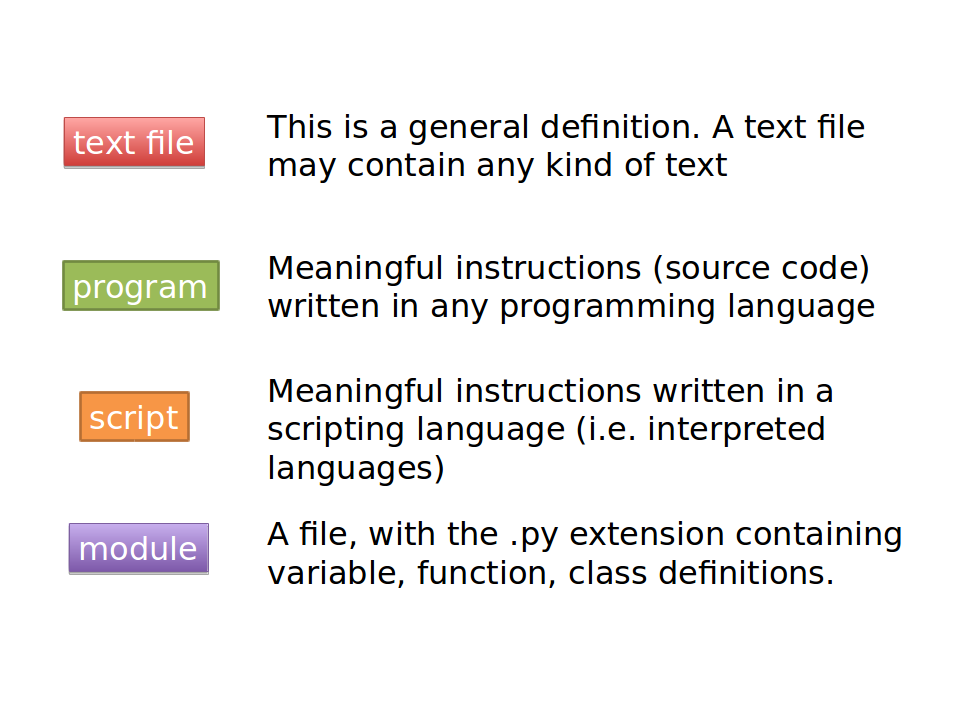
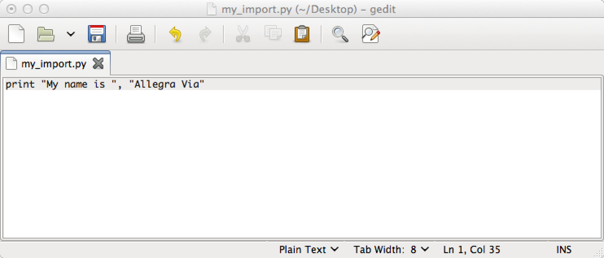
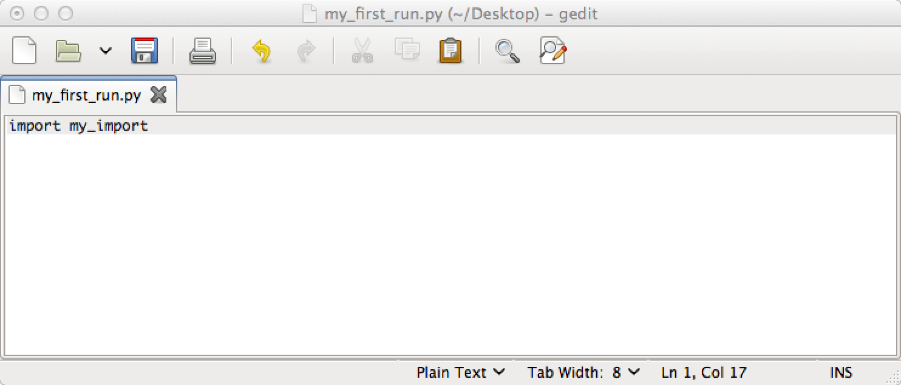
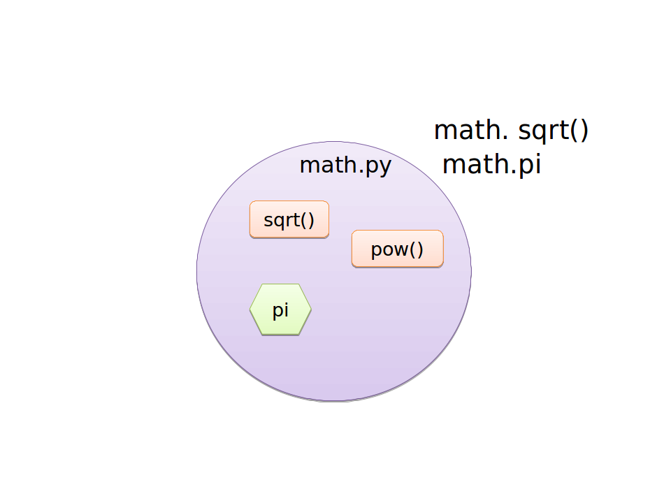
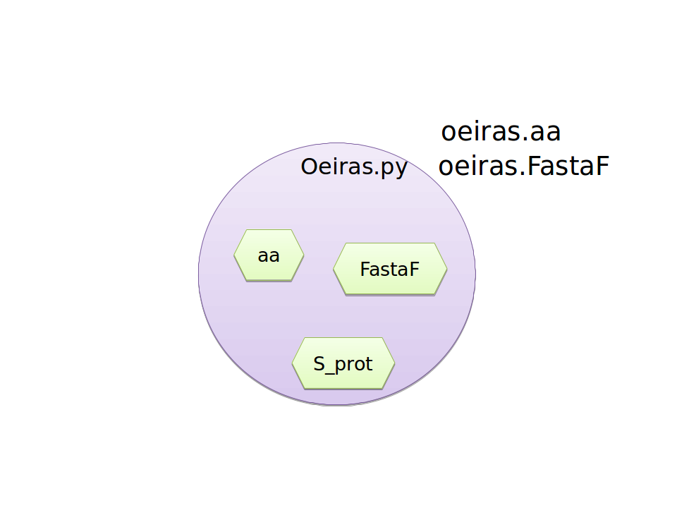
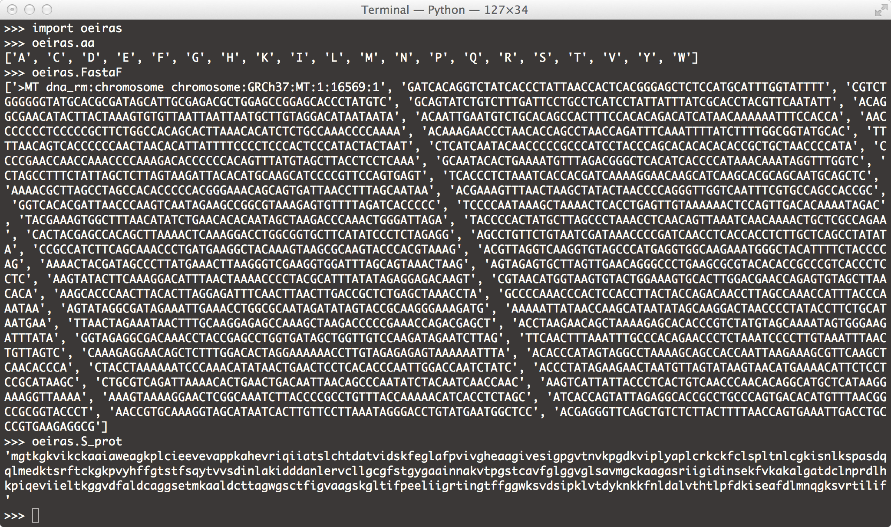
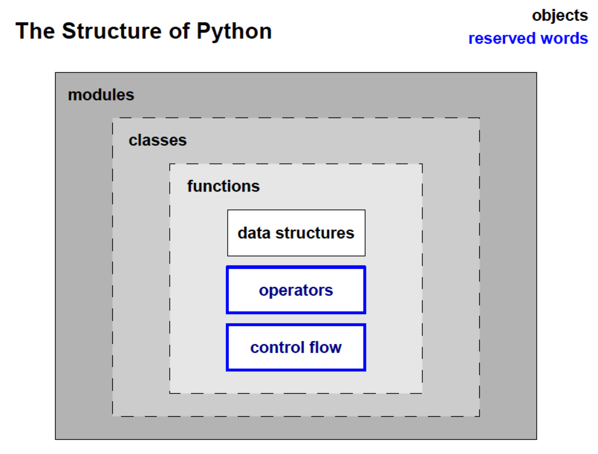

<a href="https://github.com/ELIXIR-ITA-training/python_course"> Back to Timetable</a>

#Modules are containers for data and functions

The content of a module can be used in a script (or in a different module) by importing the module




#### In Python, a program (or a script) can be also written in the interactive interpreter

#### A program or script can be considered as a module that contains both definitions and “actions”

Try the following:
> -   Open a text file using gedit
> -   Write:`print "My name is:", "myname"`



> -   Save the file in your home directory with the name: `my_name.py`
> -   Go to your home directory using the command-line interface
> -   Type at the prompt: `python my_name.py`
> -   Open a DIFFERENT text file using gedit
> -   Write: `import my_name`



> -   Save the file in your home directory with the name: `my_first_run.py`
> -    Go to your home directory using the command-line interface
> -    Type: `python my_first_run.py`

#### The Python structure - Tips and comments

- When you ```import``` a module, Python reads and executes each line contained therein.

- In general, we will call modules text files containing definitions (variables, functions, classes)

- We will call programs or scripts text files containing definitions AND actions. 

- You will **run programs** and **import modules**.

- It is good practice to write small re-usable pieces of code in separate modules

- Python code can be written in two different "containers":
  - Interactive interface
  - Modules (or programs)

- Inside modules you can define other containers: classes and functions

- The objects contained in modules (and, if you want to, in classes and functions) are: data structures; variable definitions; operators; control flow statements.

## The “dot” syntax







## The structure of Python



#### module.class.method()
#### module.method()
#### class.method()
#### module.variable
#### module.class.variable
