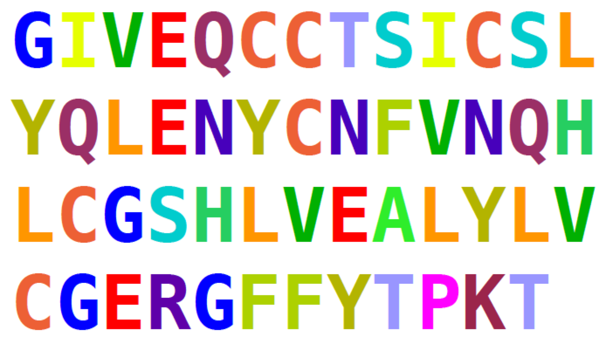
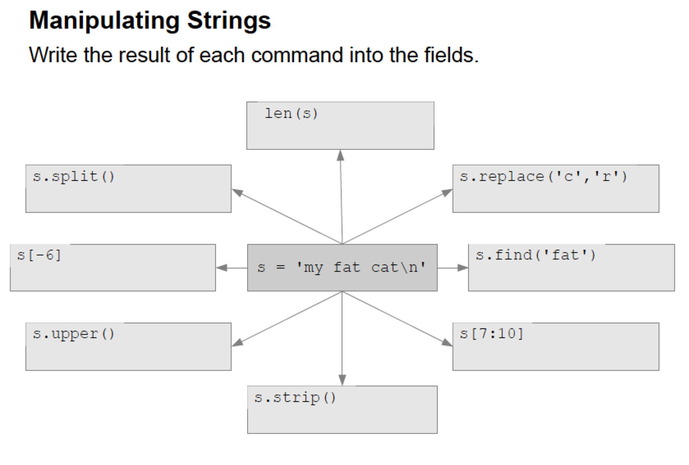
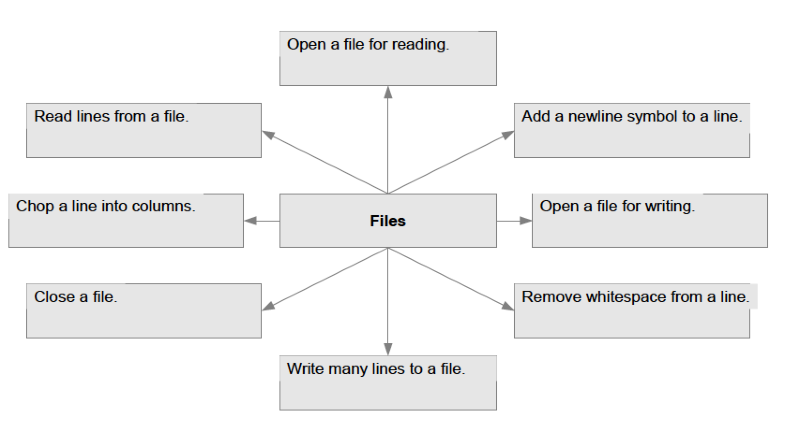

<a href="https://github.com/ELIXIR-ITA-training/python_course"> Back to Timetable</a>


# Repeating things



## Counting amino acids

```
# insulin [Homo sapiens] GI:386828
insulin = "GIVEQCCTSICSLYQLENYCFVNQHLC\
      GSHLVEALYLVGERGFFYTPKT"

for amino_acid in "ACDEFGHIKLMNPQRSTVWY":
  number = insulin.count(amino_acid)
  print amino_acid, number
```
## Repetitive tasks
Consider the solutions of challenge #4 from previous session:

```
dna = "AGCTTCGA"

print dna.count("A")
print dna.count("C")
print dna.count("T")
print dna.count("G")
```
```
dna = "AGCTTCGA"
elem =  dna.count ("A")
print  elem
elem =  dna.count ("C")
print  elem
elem =  dna.count ("T")
print  elem
elem =  dna.count ("G")
print  elem
```

##Loops with for
The `for` command repeats other commands:
```
dna = "AGCTTCGA”

for base in "ACTG":
  print dna.count(base)
```

The commands that are repeated must be **indented (shifted right by four spaces)**.


## Compare
```
dna = "AGCTTCGA”
for base in "ACTG":
  print dna.count(base)
```
Would you prefer this implementation?
```
dna = "AGCTTCGA"

print dna.count("A")
print dna.count("C")
print dna.count("T")
print dna.count("G")
```
Why or why not?

> ####  **Challenge #1**
---
>Retrieve the 1132-residue sequence of human telomerase reverse transcriptase isoform 1 from the NCBI protein database. Choose the FASTA format. Copy the sequence to a text file (`telomerase.txt`). Write a program that reads the telomerase.txt file and prints first the whole sequence and then the sequence residue by residue.
>
----


See the <a href="https://github.com/Pfern/BPBR16-Bioinformatics-using-Python-for-Biomedical-Researchers/blob/master/day2/2-RepeatingThings/RepeatingThings.solutions.md#solution-to-challenge-1">solution to challenge #1<a/>


## Use a `for` loop to read a file line by line
```
Input_file = open(“my_file.txt”)
for line in Input_file:
  print line
```

## Look how beautiful it can be…
```
import urllib
url = 'http://www.uniprot.org/\
  uniprot/P12931.fasta'
src_human = urllib.urlopen(url)
for line in src_human:
  print line,
```


> ####  **Challenge #2**
---
> Write a file and program that reads the `telomerase.txt` prints its content line by line.
>
---

See the <a href="https://github.com/Pfern/BPBR16-Bioinformatics-using-Python-for-Biomedical-Researchers/blob/master/day2/2-RepeatingThings/RepeatingThings.solutions.md#solution-to-challenge-2">solution to challenge #2<a/>


## Manipulating string



> ####  **Challenge #3**
---
> Which amino acid is the most frequent in the sequence of the telomerase reverse transcriptase isoform 1?
>
---


See the <a href="https://github.com/Pfern/BPBR16-Bioinformatics-using-Python-for-Biomedical-Researchers/blob/master/day2/2-RepeatingThings/RepeatingThings.solutions.md#solution-to-challenge-3">solution to challenge #3<a/>


### Recap

