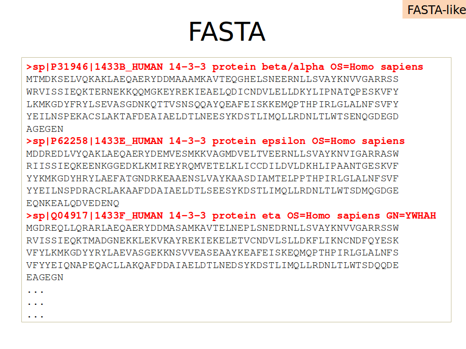
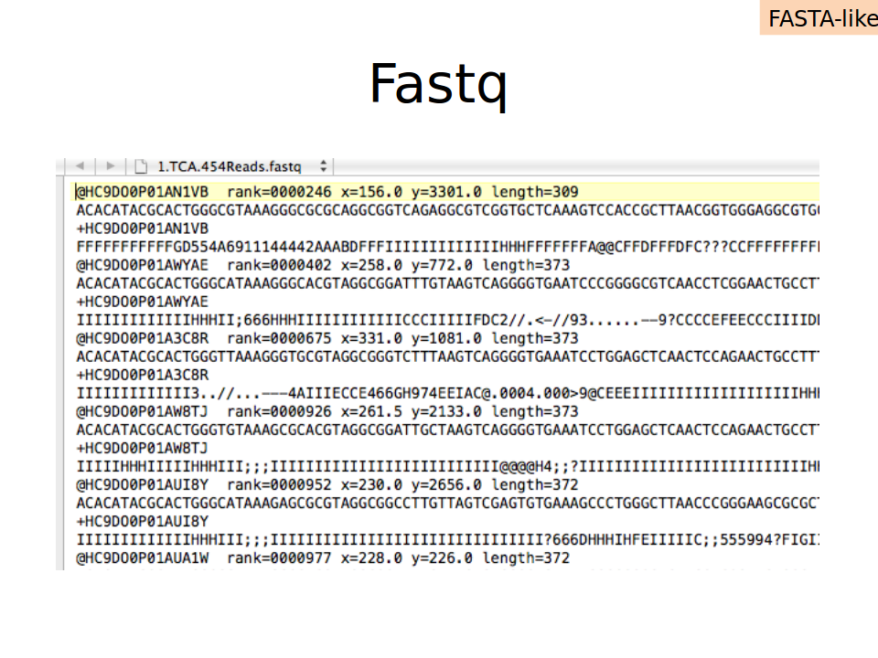
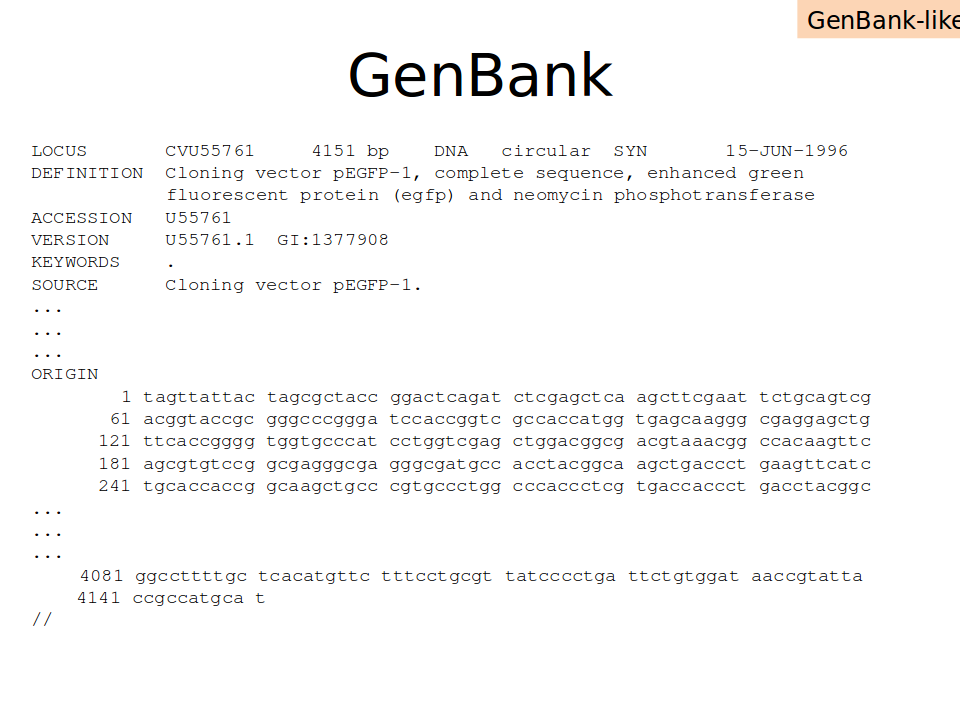
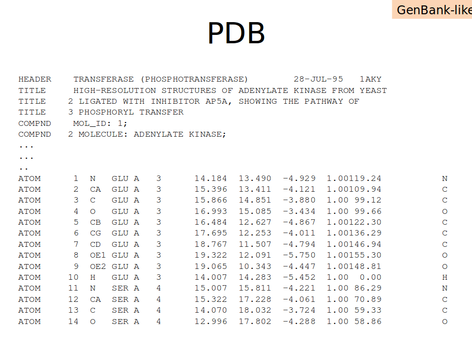
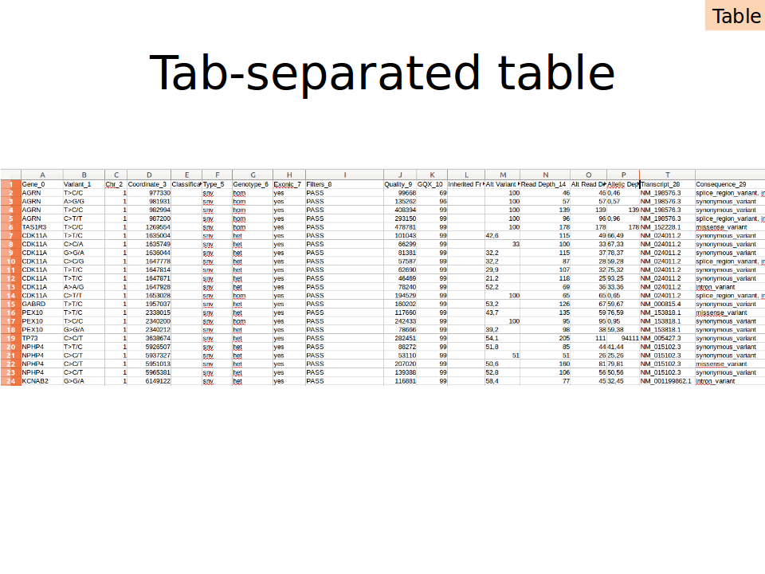
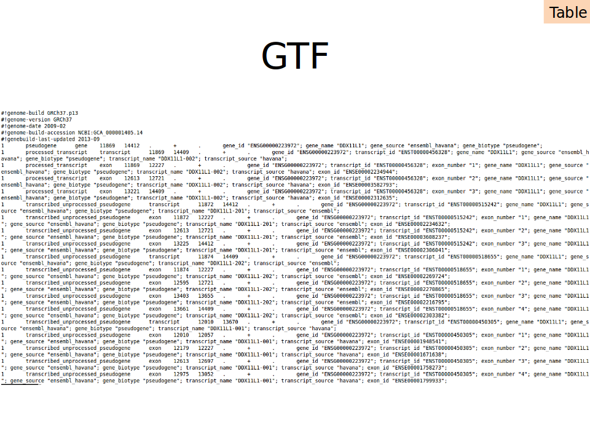
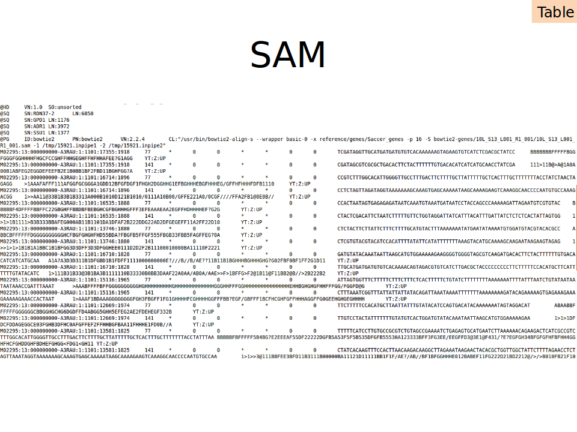
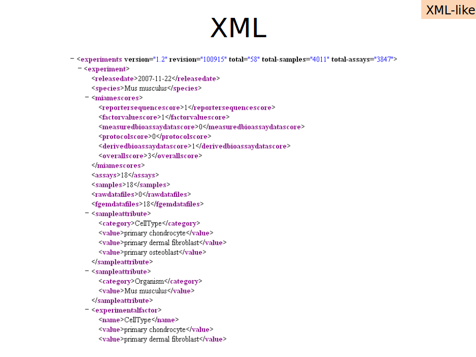

<a href="https://github.com/Pfern/BPBR16-Bioinformatics-using-Python-for-Biomedical-Researchers#this-repository-is-for-the-course-materials-and-it-is-organized-as-follows"> Back to Timetable</a>

# File formats in bioinformatics

There are four types of computer readable formats in bioinformatics

- FASTA-like
- GenBank-like
- Tables
- XML-like

