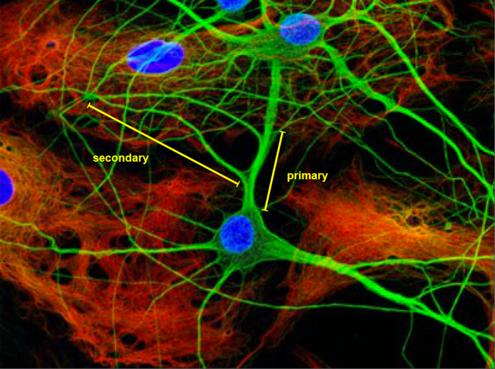
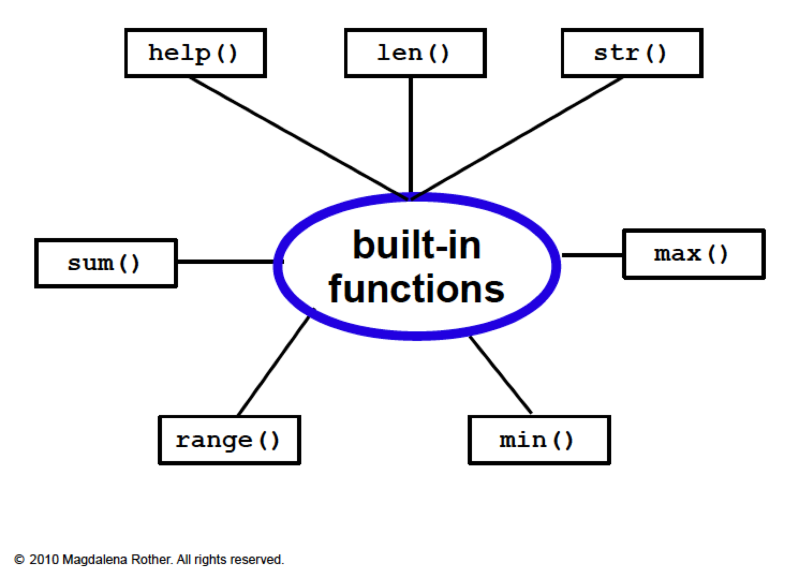
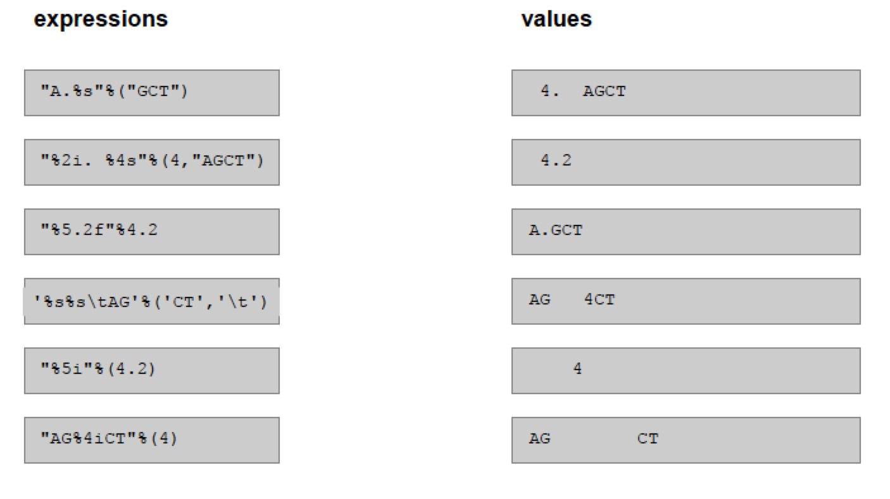

<a href="https://github.com/Pfern/BPBR16-Bioinformatics-using-Python-for-Biomedical-Researchers#this-repository-is-for-the-course-materials-and-it-is-organized-as-follows"> Back to Timetable</a>

# Data columns

## Reading  data from a table and writing data to a table

After this module you can:
+ Read a list of numbers from a text file to a list
+ Calculate the average value of a list of numbers
+ Calculate the average value of the numbers of a table's column
+ Write a list of numbers to a text file



We will use the file `neuron_data.txt` containing data on dendrites lengths:

```
16.38
139.90
441.46
29.03
40.93
202.07
142.30
346.00
300.00
```

and the file `neuron_data-2.txt` that contains the same data plus an extra column with the indication 1 for primary neurons and 2 for secondary neurons:

```
1         16.38
2         139.90
2         441.46
1         29.03
1         40.93
2         202.07
1         142.30
2         346.00
2         300.00
```
### What do we have to do?

+  Read data columns from files
+  Store data columns to data structures (lists)
+  Convert text into numbers
+  Convert numbers into text
+  Write text to data columns (i.e. with appropriate format)


**Our Goal  is to beat Excel at its own game!**

## Some useful built-in functions

- `split()` Stores elements from different columns to a list
- `unpack()` Stores elements from different columns to a list using a given format
- `join()` Concatenates objects from a list
- `strip()` Removes blank spaces and newline characters
- `int()` Converts a string into an integer
- `float()` Converts a string into a floating point number
- `str()`  Converts an object into a string
- `repr()` Converts an object into a string

> ####  **Challenge #1**
---
> Write a program that reads the file with neuron lengths (neuron_data.txt) and stores neuron lengths as floating point numbers into a list.

---

See the solution to <a href="https://github.com/ELIXIR-ITA-training/python_course/day3/3-DataColumns/DataColumns.solutions.md#solution-to-challenge-1"> challenge #1<a/>
<br>
<br>


> ####  **Challenge #2**
---
> Extend the program so that it read data form `neuron_data-2.txt` and  stores primary and secondary neuron lengths to different lists.
>
---

See the solution to <a href="https://github.com/ELIXIR-ITA-training/python_course/day3/3-DataColumns/DataColumns.solutions.md#solution-to-challenge-2"> challenge #2<a/>
<br>
<br>


## Manipulating data in the columns

+  Calculate max and min length
+  Calculate their average length
+  Calculate the standard deviation




> ####  **Challenge #3**
---
>Extend program 2 so that it calculates the neuron length average separately for primary and secondary neurons. Print the two averages: which neurons are on average longer?
>
---

See the solution to <a href="https://github.com/ELIXIR-ITA-training/python_course/day3/3-DataColumns/DataColumns.solutions.md#solution-to-challenge-3"> challenge #3<a/>
<br>
<br>


> ####  **Challenge #4**
---
Extend program 3 so that it calculates the standard deviation
of the neuron length.
>
---

See the solution to <a href="https://github.com/ELIXIR-ITA-training/python_course/day3/3-DataColumns/DataColumns.solutions.md#solution-to-challenge-4"> challenge #4<a/>
<br>
<br>


## How to **write** data to columns

This implies that data needs to be nicely formatted and written to a file

+  String concatenation
+  String formatting

The argument of the `write()` function MUST be a string

```
>>> out = open('data_out.txt', 'w')
>>> out.write(3)
Traceback (most recent call last):
File "<stdin>", line 1, in <module>
TypeError: expected a character buffer object
>>>
```

```
>>> out = open('data_out.txt', 'w')
>>> out.write(str(3))
>>>
```

An example of string concatenation using `+` :
```
out = open('data_out.txt', 'w')
out.write(str(1) + '\t' + str(16.38) + '\n')
out.close()
```


> ####  **Challenge #5**
---
>Use two lists with data from `neuron_data-2.txt` to write a table identical to `neuron_data-2.txt`.  Do it using **string concatenation**.
>
---

See the solution to <a href="https://github.com/ELIXIR-ITA-training/python_course/day3/3-DataColumns/DataColumns.solutions.md#solution-to-challenge-5"> challenge #5<a/>
<br>
<br>


## String formatting

Nice output can be generated by formatting characters:

```
print '%d'%(77)
print '%s'%('text')
print '%4.1f'%(2.1111)
```
```
print 'The square root of %5.2f is %5.2f'%(a, math.sqrt(a))

print 'The square root of %10.2f is %5.2f'%(a, math.sqrt(a))

print "%i%s%f%s"%(1, '\t', 2.5, '\n')

import math
A = 25
S = 'The square root of {0} is  {1}'
print  S.format (a,  math.sqrt(a))
```


> ####  **Challenge #6**
---
>Use two lists with data from `neuron_data-2.txt` to write a table identical to `neuron_data-2.txt`. Do it using **string formatting**.
>
---

See the solution to <a href="https://github.com/ELIXIR-ITA-training/python_course/day3/3-DataColumns/DataColumns.solutions.md#solution-to-challenge-6"> challenge #6<a/>
<br>
<br>


## Reading and writing tables
+ Read each table column into a different list
+  Use a for loop running over the length of the list to write the elements of the lists to a file (using string concatenation or formatting)
+  You can write the columns in a different order

### Match the formatting expressions and their result




> ####  **Challenge #7**
---
>Write a program that reads the `neuron_data-2.txt` file, calculates the number of primary neurons, their total length, and the shortest and the longest lengths.
>
>Write the results to a file using string formatting.
>
>You can repeat the exercise for secondary neurons.
>
----

See the solution to <a href="https://github.com/ELIXIR-ITA-training/python_course/day3/3-DataColumns/DataColumns.solutions.md#solution-to-challenge-7"> challenge #7<a/>
<br>
<br>
