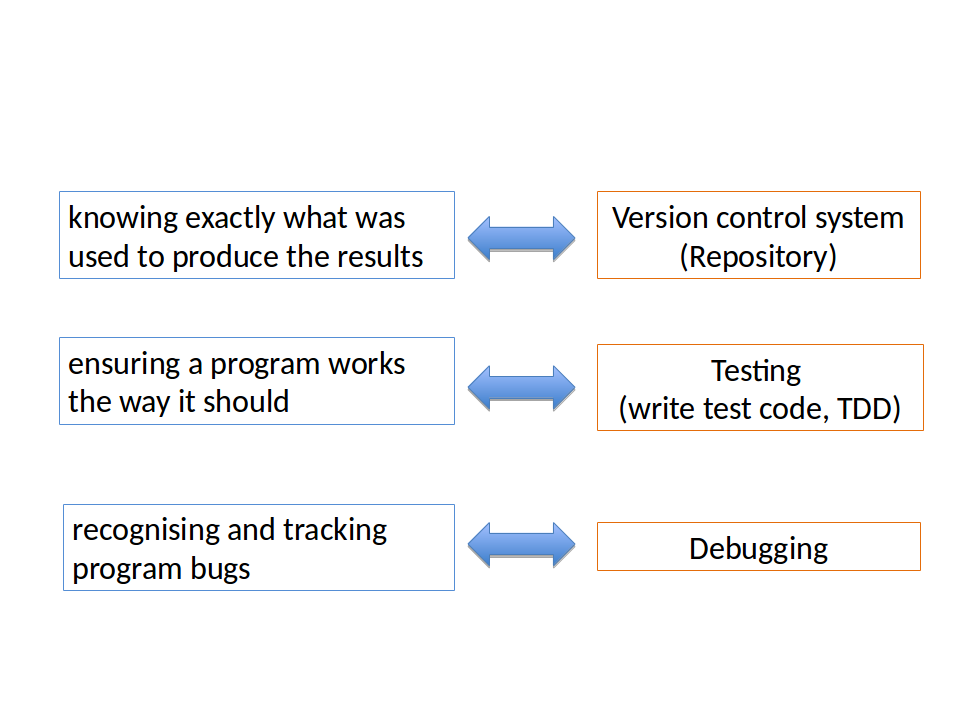
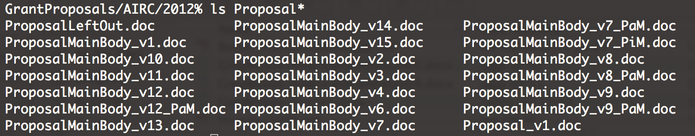

#Writing good programs

Best practices in programming help you to do a more efficient and better science

>*…if experimentalists don’t calibrate their instruments, check the purity of the reagents, take careful notes, keep tubes clean, etc. what they’re doing isn’t considered science.*
>
> *Why should we consider science rarely reproducible results of non tested programs?*
>

### Software carpentry
*(best practices to write good programming projects)*


The [Software Carpentry](https://software-carpentry.org) Foundation is a non-profit volunteer organisation whose members teach researchers basic software skills


Software carpentry methods focuse on small-scale and immediately practical issues.

<center>
It will help you:<br/>
Become faster and more efficient<br/>
Share your work without pain<br/>
Collaborate more effectively<br/>
**Trust your results<br/>
Reproduce your results**<br/>
In other words…<br/>
**Do a better science**<br/>
Source[Software Carpentry](https://software-carpentry.org)<br/>
</center>


## Best practices to write better programs (or entire projects)


1. Design the project upfront
2. Write clean, transparent programs
3. Document your programs
4. Use data standards<br/>
**Quality control**<br/>
5. Use a version control system (repository)
6. Test your programs
7. Debug your code<br/>
**Cycle of software development**<br/>
8.  Release your code
9.  Code review                                        

### Design the project upfront

Good scientists do not perform experiments before developing a hypothesis and planning materials and methods to test that hypothesis

> **Bioinformaticians often start coding with very little or no planning at all**

> **Before the first line of code is written, software projects should be thoughtfully designed**

<center>
*Prior Planning and Preparation Prevents “Pretty” Poor Performance*
[military seven Ps rule](https://en.wikipedia.org/wiki/7_Ps_%28military_adage%29)<br/>


Amfahr J, Bustamante A, Rome P. Exploring Agile: The Seapine Agile Expedition
</center>


### How much design?

**What will the program(s) do?**  and **How will the results
produced by the program be verified?**


The most simple design documents describe **inputs**, how
those inputs **will be transformed** by the program(s), and
**outputs**.


Identifying the appropriate technologies or programming
languages is a vital decision during the design phase

### Techniques to write clean, transparent programs


+  Break down your project into tasks
+  Break up programming tasks into smaller steps
+  Separate Input, Processing, and Output
+  Use docstrings and comments
+  Write smaller programs
+  Format your source code

```
def read_fasta_files(directory):
    '''
    Reads a directory with many FASTA files containing protein sequences.
    '''
pass

def filter_phe(sequences):
    '''
    Removes all sequences that do not have Phenylalanine or Phe in the name.
    '''
pass

def remove_duplicates(sequences):
    '''
    Remove all sequence records, having an identical sequence.
    '''
pass

def write_fasta(sequences, filename):
    '''
    Writes a single FASTA file with aaRS sequences.
    '''
pass

if __name__ == '__main__':
    INPUT_DIR = 'aars/'
    OUTPUT_FILE = 'phe_filtered.fasta'
    seq = read_fasta_files(INPUT_DIR)
    filter_phe(seq)
    remove_duplicates(seq)
    write_fasta(seq, OUTPUT_FILE)
```

### Write smaller programs
**Simpler is better**

When you can achieve your goals without using functions, do it!<br/>
When you can do something without complex data structures, do it!<br/>
When you can cut the size of your program by half, and it still does the job, do it!<br/>
**Ultimately, the best program ever is one that gets the job done
with a single line of well-readable code.**


> Refactoring is the practice of taking small chunks of code (i.e., at the unit level) and frequently rebuilding it so that it is as simple as possible, yet still delivers the expected value.

Write programs in such a way that errors are easy to find

>*“Today I had a successful day at programming: I deleted 300 lines of code.”**
>(Lorenzo Catucci)


### Format your source code using coding guidelines

+   Convention for naming variables, functions, classes, files
+   Establishes where and how to write comments
+   Excludes certain language constructs

+  Enhance the readability of source code and avoid common coding errors

+  Avoids overadjusting code to your personal preference

+  Discourage using complex language constructs


Example: PEP8 coding guidelines and the pylint tool

### Document your programs

One of the foundations of scientific research is the lab
notebook, where materials, methods, and results are recorded
so that experiments can be repeated.


Similarly, all computer programs should be well-documented,
modular, and easy to read and follow even by users who did not
write the program.


An acceptable level of documentation might provide:
+    help through a user-guide
+    information on how to compile and execute the program
+    in-line comments describing program functions and modules

*Amfahr J, Bustamante A, Rome P. Exploring Agile: The Seapine Agile Expedition*


### Use data standard
<center>
Input and output of your programs should comply community-accepted data standards<br/>

If these are not available<br/>


Store format information in the data itself
<center/>

i.e. include documentation (metadata) describing the data
+   Format of the data
+   Definitions and assumption that allow interpreting the data


### Use a quality control process to ensure reproducibility of results

Reproducibility requires three things:




### Version control system (repository)

```
my_program.py
my_program2.py
my_program3.py
my_program3_optimised.py
my_program3_new.py
my_program3_new_new.py
```



A code repository (or version control) manages files that are being used and modified by different persons

+  Keeps track of which is the most recent version of a particular file
+   Notices whenever two people try to change the same version of a file
+   Prevents changes that overwrite each other
+   A project can be reverted to any earlier state
+   Multiple independent subprojects can be managed simultaneously


A repository can include programs, data, planning documents, related publications

It is crucial for controlling exactly which **version** of a software, which **set of input files**, which **parameters** were used to produce a specific set of **results** and at what **time**

Examples of version control systems:

- Concurrent version system (CVS) (http://cvs.nongnu.org)
- Subversion (SVN) (http://subversion.apache.org)
- GIT (http://git-scm.com)
- Bazaar (http://bazaar.canonical.com/en/)
- Mercurial (http://mercurial.selenic.com/wiki/Mercurial )

```
hg init                   #keep track of files in the directory
hg add phe_sequences.py   #add each file to the version control system explicitly
hg ci                     #commit  after changes (describe briefly changes)
hg log aars_filter.py     #return to an earlier version
hg up -r 23               #use the varsion number to update files
hg clone https://bitbucket.org/myproject/ #creates a repository
hg push                   #send the files to the server
hg pull                   #you can update changes from the server
hg up                     #to your computer
```
### Test your code

>*“Code without test is broken by design” (Jacob Kaplan Moss)*

- **Manual tests**                     
-  **Automated tests**

-   Sometimes, this is as simple as running it on a sample data
you actually want to transform, and eyeballing the results

-  Create small data files or artificial input data for testing

-   In more complex situations, you may select subsets of your
actual data, and make sure that they’re handled correctly.
