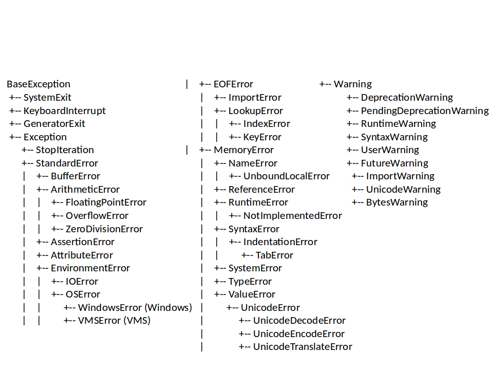

# Exception handling


```
try:
    f = open("test")
    for line in f:
        print line
except :
    f = open("test.txt")
    for line in f:
        print line
```

```
try:  
    f = open("test.txt")
except :
    print "Cannot open the input file"
    raise SystemExit
else:
    for line in f:
      print line
```

```
def main(data):
    print data

try:
    import sys
    data = sys.argv[1]
except :
    print "<usage: python my_script.py arg1>"
    raise SystemExit
else:
    main(data)
```

[Built-in exceptions](https://docs.python.org/2/library/exceptions.html)





```

def main(data):
    print data

try:
    import sys
    data = sys.argv[1]
except ImportError:
    print "<usage: python my_script.py arg1>"
    raise SystemExit
else:
    main(data)
```
