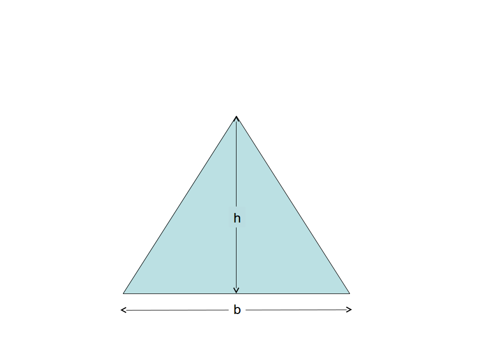

# Builtins, namespaces, functions

## Python built-ins
There are objects that are predefined in Python

- Statements: for,in,import,…
- Numbers: 3, 16.2,…
- Strings: ‘AUG
- Functions: `dir()`, `lower()`,…

When you use something without defining it, it means
that you are using a **built-in** object

## Namespaces

The collection of object names defined in a module represents the global **namespace** of that module

Each module defines its own namespace


The same name (e.g. `src`) in two different modules (e.g. `module_1.py` and `module_2.py`), indicates two distinct objects and the dot syntax makes it possible to avoid confusion between the namespaces of the two modules


> `Module_1.src`  is NOT the same as   `Module_2.src`


## Import

What actually happens when the command **import** is executed?

The code written in the imported module is entirely interpreted and **the module global namespace is imported as well**


**Where** the Python interpreter searches a module when you
import it?


**Where**  do  you  have  to  save  a  module  in  order  the
interpreter can find it?

- The module can be saved in the same directory of the
script importing it

- The module path can be added to the list of directories
where the **Python interpreter** automatically search things


It is not the same list of directories where Unix
automatically search things.

It is a list contained in the variable **`path`** of the special module **`sys`**

```
>>> import sys
>>> sys.path
['','/System/Library/Frameworks/Python.frame
work/Versions/2.5/lib/python25.zip','/System
/Library/Frameworks/Python.framework/Version
s/2.5/Extras/lib/python','/Library/Python/2.
5/site-packages']
>>>
```


Check that the `tgac.py` module is in one of your subdirectories
(should be in `~/Modules/Day3/Functions/d3_functions_data_scripts`)

Go to a different directory (e.g. `~/Modules/Day3/Functions`)

Start the interpreter and type:

```
>>>import tgac
```

What happens?


Now try:

```
>>> import sys
>>> sys.path.append('~/Modules/Day3/Functions\
... Data&Scripts')
>>> import tgac
```

## The built-in function `dir()`

`dir()` returns a list of the names defined in the namespace of an object

```
>>>dir(tgac)
```

## Functions

**A block of code that performs a specific task**


Why do we use functions?


They are useful to organise your script, in particular if you need to **repeat actions** (e.g. a complex calculation) several times


A function can be accessed from different parts of a script or even from different scripts.


In order to use a function, you have first to define it and then to call it


### Program 1
-  Write a function triangle_area(b, h) that returns the area of a triangle
-    Call the function for b = 2.28 and h = 3.55
-    Print the result





#### Program 1 - solution

```
def triangle_area(b, h):
    A = (b*h)/2.0 # function  body
    return A      # function  body

print triangle_area(2.28, 3.55)
```

```
def triangle_area(b, h):
    return (b*h)/2.0

print triangle_area(2.28, 3.55)
```

## General remarks

- The statement to define a function is `def`

- A function must be **defined** and **called** using brackets

- The body of a function is a block of code that is initiated
by a colon character followed by *indented instructions*

- The last indented statement marks the end of a function definition

### More remarks

- You   can   insert   in   the   body   of   a   function   a
documentation  string  in  quotation  marks.  This  string
can  be  retrieved  using  the `__doc__`  attribute  of  the
function object

- You can **pass arguments** to a function

- A function may or may not **return** a value

```
def triangle_area(b, h):
    '''Returns the area of a triangle'''  
    return (b*h)/2.0

print triangle_area.__doc__
```

### Program 2

Define a function with two arguments: `get_values(arg1, arg2)`
that returns the sum, the difference, and the product of `arg1` and `arg2`.

#### Program 2 - solution

```
def get_values(arg1, arg2):
    s = arg1 + arg2
    d = arg1 - arg2
    p = arg1 * arg2
    return s, d, p

print get_values(15, 8)
```

## Remarks
-  The statement `return` exits a function, optionally passing
back a value to the caller.

-   A `return`  statement  with  no  arguments  is  the  same  as
returning `None`.

-   The returned value can be assigned to a variable

```
>>> def j(x,y):
...     return x + y
...
>>> s = j(1, 100)
>>> print s
101
>>>
```
## Function arguments

Every Python object can be passed as argument to a function.
A function call can be the argument of a function too.

```
>>> def increment(x):
...     return x + 1
...
>>> def print_arg(y):
...     print y
...
>>> print_arg(increment(5))
6
>>>
```

Multiple parameters can be passed to a function. In this case, the order of the arguments in the caller must be exactly the same as that in the function definition

```
>>> def print_funct(num, seq):
...     print num, seq
...     return
...
>>> print_funct(10, "ACCTGGCACAA")
10 ACCTGGCACAA
>>>
```

The sequence of arguments passed to a function is a **tuple**


AND


Functions return multiple values in the form of
**tuples** as well


### Tuples


A tuple is an **immutable** sequence of object

This means that, once you have defined it, you cannot change/replace its elements


`variabile = (item1, item2, item3,…)``


Brackets are optional, i.e. you can use either:


`Tuple = (1,2,3)` or   `Tuple = 1,2,3`


A **tuple of a single item** must be written either:


`Tuple = (1,)` or   `Tuple = 1,`

```
>>> my_tuple = (1,2,3)
>>> my_tuple[0]       #indexing
1
>>> my_tuple[:]       #slicing
(1, 2, 3)
>>> my_tuple[2:]      #slicing
(3, )
```

BUT

```
>>> my_tuple[0] = 0     #re-assigning
(Forbidden)
Traceback (most recent call last):
File "<stdin>", line 1, in <module>
TypeError: 'tuple' object does not support
item assignment
>>>
```

```
def f(a,b):
    return a + b, a*b, a – b

sum, prod, diff = f(20, 2)
print sum

result = f(20, 2)
print result
print result[0]
```

It is possible to assign a name to the arguments of a function. In this case, the order is not important

```
>>> def print_funct(num, seq):
...     print num, seq
...     return
...
>>> print_funct(seq = "ACCTGGCACAA", num = 10)
10 ACCTGGCACAA
>>>
```


## Default arguments

It is also possible to use default arguments (optional). These optional arguments must be placed in the last position(s) of the function definition

```
def print_funct(num, seq = "A"):
    print num, seq
    return

print_funct(10, "ACCTGGCACAA")

print_funct(10)
```

## Summary

- def F(x,y):
- F(3,'codon')
- return
- function arguments


### Program 3


Write a function that takes as arguments two points [x1, y1, z1] and [x2, y2, z2] and returns the distance between the two points.

#### Program 3 - solution

```
import math

def distance(p1, p2):
    dist = math.sqrt((p1[0]-p2[0])**2 +
                     (p1[1]-p2[1])**2 +
                     (p1[2]-p2[2])**2)
    return dist

p1 = (43.64, 30.72, 88.95)
p2 = (45.83, 31.11, 92.04)

print "Distance:", distance(p1, p2)
```

### Program 4

Write a function that :
-  Takes as input a file name (of a FASTA file).
-  Opens the file.
-  Returns the header of the sequence record.

Print the header.


#### Program 4 - solution

```
def return_header(filename):
    fasta = open(filename)
    for line in fasta:
      if line[0] == '>':
        return line

print return_header('SingleSeq.fasta')
```

#### Program 5


Insert the function call in a for loop running on a list of 3 sequence file names.

#### Program 5 - solution
```
def return_header(filename):
    fasta = open(filename)
    for line in fasta:
        if line[0] == '>':
            return line

filenames = ['SingleSeq1.fasta',
              'SingleSeq2.fasta',
              'SingleSeq3.fasta']

for name in filenames:
    print return_header(name)
```

### Program 6


Consider two output schemes for exercise 4:
1. All the the headers are written to the same output file
2. Each header is written in a separate output file


#### Program 6 – solution a

```
def return_header(filename):
    fasta = open(filename)
    for line in fasta:
        if line[0] == '>':
            return line

filenames = ['SingleSeq1.fasta',
             'SingleSeq2.fasta',
             'SingleSeq3.fasta']

output = open("headers.txt", "w")

for name in filenames:
    output.write(return_header(name) + '\n')

output.close()
```

#### Program 6 – solution b

```
def return_header(filename):
    fasta = open(filename)
    for line in fasta:
        if line[0] == '>':
          return line

filenames = ['SingleSeq1.fasta',
             'SingleSeq2.fasta',
             'SingleSeq3.fasta']
n = 0
for name in filenames:
    n = n + 1
    output = open("header" + str(n) + ".txt", "w")
    output.write(return_header(name))

output.close()
```

### Program 7


Write a function that takes as argument a Genbank
record and returns the nucleotide sequence in
FASTA format.

```
def genbank2fasta(filename):
    name = filename.split('.')[0]
    InputFile = open(filename)
    OutputFile = open(name + ".fasta","w")
    flag = 0
    for line in InputFile:
        if line[0:9] == 'ACCESSION':
            AC = line.split()[1].strip()
            OutputFile.write('>'+AC+'\n')
        if line[0:6] == 'ORIGIN':
            flag = 1
            continue
        if flag == 1:
            fields = line.split()
            if fields != []:
                seq = ''.join(fields[1:])
                OutputFile.write(seq +'\n')
OutputFile.close()

filename = "ap006852.gbk"
genbank2fasta(filename)
```

## General remarks

-  Python uses **dynamical** namespaces: when a function is
called, *its namespace is automatically created*

- The variables defined in the body of a function live in its *local* namespace and not in the script (or module) *global* namespace

- Local objects can be made global using the **global** statement

- When a function is called, names of the objects used in its body
are first searched in the function namespace and subsequently,
if they are not found in the function body, they are searched in
the script (module) global namespace.

```
>>> def f():
...     x = 100
...     return x
...
>>> print x
Traceback (most recent call last):
File "<stdin>", line 1, in <module>
NameError: name 'x' is not defined
>>> f()
100
>>> print x
Traceback (most recent call last):
File "<stdin>", line 1, in <module>
NameError: name 'x' is not defined
>>>
```
`x` is a local name of the function `f()` namespace and it is not
recognised by the `print` statement in the main script  even
after the function call

```
>>> def g():
...     global x
...     x = 200
...     return x
...
>>> print x
Traceback (most recent call last):
File "<stdin>", line 1, in <module>
NameError: name 'x' is not defined
>>> g()
200
>>> print x
200
>>>
```

The variable `x`, defined in the body of the `g()` function, is made
global using the **global** statement but is recognised by the
`print` statement in the main script  only after the function call

```
>>> y = "ACCTGGCACAA"
>>> def h():
...     print y
...
>>> h()
'ACCTGGCACAA'
```

`y` is recognized when `h()` is called as it is a global name.
The  number  of  arguments  can  be  variable  (i.e.  can  change  from  one function call to the other); in this case, you can use * or ** symbols.

1st  case             (\*args) =>          tuple of arguments
2nd  case             (\**args)=>          dictionary of arguments

```
>>> def print_args(\*args):
...     print args
...     return
...
>>> print_args(1,2,3,4,5)
(1, 2, 3, 4, 5)
>>> print_args("Hello world!")
(‘Hello world!’,)
>>> print_args(100, 200, "ACCTGGCACAA")
(100, 200, ‘ACCTGGCACAA’)
>>> def print_args2(**args):
...     print args
...     return
...
>>>  print_args2(num  =  100,  num2  =  200, seq  =
"ACCTGGCACAA")
{'num': 100, 'seq': 'ACCTGGCACAA', 'num2': 200}
```
