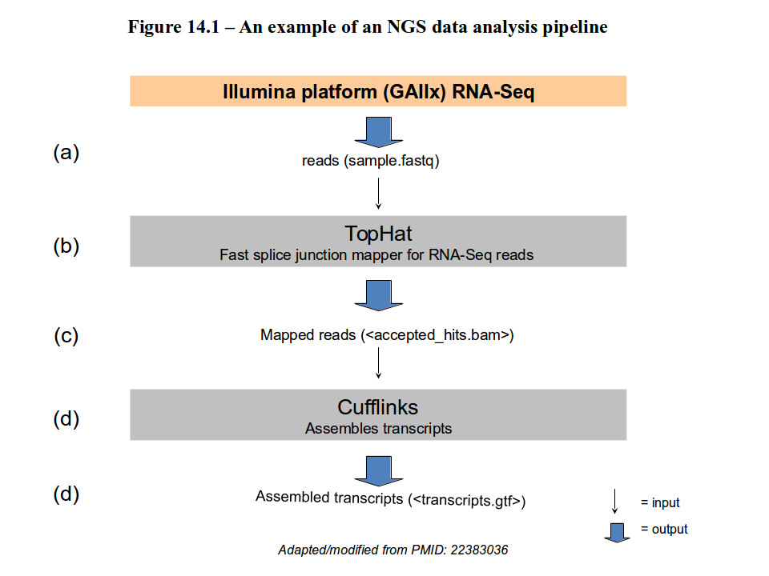
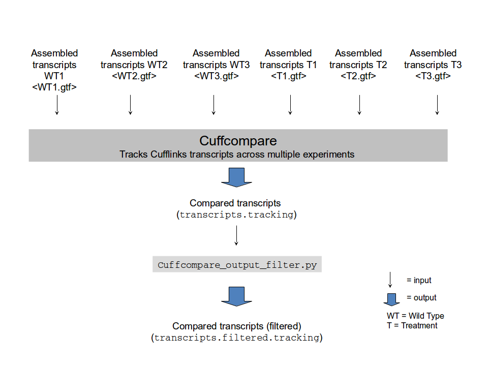

## NGS analysis: an example of a pipeline
Figure 14.1 – An example of an NGS data analysis pipeline



## Tophat


[TopHat](http://tophat.cbcb.umd.edu/manual.shtml#toph) needs you to  specify a path to the index files and an input file containing your reads.

The first argument should be the full path to the directory containing the index plus the **prefix** of the index files.

Usage:
``''
tophat [options]* <genome_index_base> <reads1_1[,...,readsN_1]>


tophat –o <tophat_output_dir> /path/to/h_sapiens reads1.fastq,
reads2.fastq,reads3.fastq
```
### Tophat input files (1)
```
<genome_index_base><br/>
```
The basename of the genome index to be searched. The
basename is the name of any of the index files up to but not
including the first period. Bowtie first looks in the current
directory for the index files, then looks in the `indexes`
subdirectory under the directory where the currently-running
bowtie executable is located, then looks in the directory
specified in the `BOWTIE_INDEXES` environment variable.
Please note that it is highly recommended that a FASTA file with
the sequence(s) the genome being indexed be present in the
same directory with the Bowtie index files and having the name
`<genome_index_base>.fa`. If not present, TopHat will
automatically rebuild this FASTA file from the Bowtie index files.

```
<reads1_1[,...,readsN_1]>
```
A comma-separated list of files containing reads in FASTQ or
FASTA format.

### Tophat options

```
-o/--output-dir <string>
```
Sets the name of the directory in which TopHat will write all
of its output. The default is `./tophat_out`.


## Cufflinks

Check the [Cufflinks website](http://cufflinks.cbcb.umd.edu/manual.html#cufflinks) for more details


Usage:
```
cufflinks [options]* <aligned_reads.(sam/bam)>
```

### Cufflinks input file

```
<aligned_reads.(sam/bam)>
```

A file of RNA-Seq read alignments in the [SAM format](http://genome.sph.umich.edu/wiki/SAM). SAM is a standard short read alignment, that allows aligners to attach custom tags to individual alignments, and Cufflinks requires that the alignments you supply have some of these tags. SAM (Sequence Alignment/Map) format is a generic format for storing large nucleotide sequence alignments.

### Cufflinks options
```
-o/--output-dir <string>
```

Sets the name of the directory in which Cufflinks will write all of its output. The default is `./`.

### Cufflinks output file

Cufflinks produces three output files:
1. `transcripts.gtf` This GTF file contains Cufflinks' assembled
isoforms.

2. `isoforms.fpkm_tracking`
This file contains the estimated
isoform-level expression values in the generic FPKM Tracking
Format.

3.  `genes.fpkm_tracking`
This file contains the estimated gene-
level expression values in the generic FPKM Tracking Format.

```
import os

tophat_output_dir = '/home/RNA-seq/tophat'
tophat_output_file = 'accepted_hits.bam'
bowtie_index_dir = '/home/RNA-seq/index'
cufflinks_output_dir = '/home/RNA-seq/cufflinks'
cufflinks_output_file = 'transcripts.gtf'
illumina_output_file = 'sample.fastq'

tophat_command = 'tophat -o %s %s %s'%(tophat_output_dir,
bowtie_index_base, illumina_output_file)

os.system(tophat_command)

cufflinks_command = 'cufflinks -o %s %s%s%s'%
(cufflinks_output_dir, tophat_output_dir, os.sep, tophat_output_file)

os.system(cufflinks_command)
```
### Input and output of the Cuffcompare program for transcript comparison





### `transcripts.tracking` (two rows only)

```
Medullo-Diff_00000001    XLOC_000001     Lypla1|uc007afh.1
q1:NSC.P419.228|uc007afh.1|100|35.109496|34.188903|36.030089|397.404732|2433 q2:NSC.P429.18|uc007afh.1|100|15.885823|15.240240|16.531407|171.011325|2433 q3:NSC.P437.15|uc007afh.1|100|18.338541|17.704857|18.972224|181.643949|2433 q4:CSC.Mmb8.236|uc007afh.1|100|22.594194|21.925964|23.262424|225.248080|2433 q5:CSC.Mmb10.251|uc007afh.1|100|22.778360|22.025125|23.531595|255.416281|2433 q6:CSC.Mmb21.221|uc007afh.1|100|17.288114|16.675834|17.900395|184.487708|2433 Medullo-Diff_00000002    XLOC_000002     Tcea1|uc007afi.2 = q1:NSC.P419.228|uc007afi.2|18|1.653393|1.409591|1.897195|18.587029|2671-q3:NSC.P437.108|uc007afi.2|100|4.624079|4.258801|4.989356|45.379750|2671
-
-
```

>The NGS pipeline can be applied to different sample cells to determine the transcriptome of each ofthem. For example, it can be applied to three replicas of a wild type cell (WT1, WT2, WT3) or to three replicas of a treated cancer cell (T1, T2, T3). Replicas are necessary to obtain more reliable results.<br/>
>If you want to compare the six transcriptomes  obtained from different sample cells, you can use the Cuffcompare  program  from  the  Cufflinks  package.  Cuffcompare  takes  Cufflinks .gtf output  files  as input   and   tracks   transcripts   across   multiple   experiments   (i.e.   samples).<br/>
> The   output   file (transcripts.tracking)  consists  of  a  table  where  each  row corresponds  to  a  single  transcript  and  the columns contain information about different samples. For each transcript, the information for a given sample (e.g. the one labeled with the symbol q1) looks like:
```
q1:NSC.P419.228|uc007afh.1|100|35.109496|34.188903|36.030089|397.404732|2433
```
>Where q1 is the sample label and all the other fields (separated  by a pipe) provide details  about the transcript  in  that  sample,  including  the  transcript  ID  (NSC.P419.228|uc007afh.1),  the  gene  ID (uc007afh.1),  the  fmi  (fraction  of  the  major  isoform,  100),  the  fpkm  (expression  mean  value, 35.109496),  min  and max  expression  values  (34.188903  and 36.030089, respectively),  the  transcript coverage (397.404732), and the transcript length (2433).<br/>
>When a given transcript has not been detected in a sample, the corresponding cell in the table contains a dash (`-`). The transcripts.tracking file can be filtered in order to only retain transcripts that appear in at least two  out  of  the  three  replicas  at  hand  (or  in  whatever  fraction  of  replicas). This  is  what  the Cuffcompare_output_filter.py program does.


#### Remove from `transcripts.tracking` the transcripts (i.e. file rows)
occurring in only one out of the three WT1, WT2, and WT3 (or T1,
T2, and T3) samples.

#### Saved and skipped rows in the `transcripts.tracking` file


The presence of `qi` means that the information about the replica is available. `-` means that the information is not available. Each row corresponds to a different transcript.


#### Remove from transcripts.tracking the transcripts (i.e. file rows) occurring in only one out of the three WT1, WT2, and WT3 (or T1, T2, and T3) samples.

```
tracking = open('transcripts.tracking', 'r')
out_file = open('transcripts-filtered.tracking', 'w')

for track in tracking:
    #split tab-separated columns
    columns = track.strip().split('\t')
    wildtype = columns[4:7].count('-')
    treatment = columns[7:10].count('-')
    if wildtype < 2 or treatment < 2:
        out_file.write(track)

tracking.close()
out_file.close()
```

```
tracking = open('transcripts.tracking','r')
trackingOut = open('transcripts-filtered.tracking', 'w')

for track in tracking:
    columns = track.strip().split('\t')
    WT = 0; T = 0
    if columns[4] != '-': WT += 1
    if columns[5] != '-': WT += 1
    if columns[6] != '-': WT += 1
    if columns[7] != '-': T += 1
    if columns[8] != '-': T += 1
    if columns[9] != '-': T += 1
    if WT > 1 or T > 1:
        trackingOut.write(track)
tracking.close()
trackingOut.close()
```
