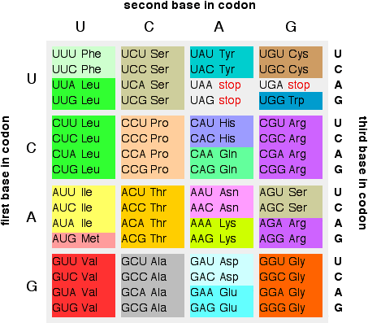

# Searching (and manipulating) your data



```
>A06662 Synthetic nucleotide sequence of the human GSH transferase pi gene. :
Location:1..1000
UGGGACCAGUCAGCAGAGGCAGCGUGUGUGCGCGUGCGUGUGCGUGUGUG
UGCGUGUGUGUGUGUACGCUUGCAUUUGUGUCGGGUGGGUAAGGAGAUAGAGAUGGGCGG
GCAGUAGGCCCAGGUCCCGAAGGCCUUGAACCCACUGGUUUGGAGUCUCCUAAGGGCAAUG
GGGGCCAUUGAGAAGUCUGAACAGGGCUGUGUCUGAAUGUGAGGUCUAGAAGGAUCCUCC
AGAGAAGCCAGCUCUAAAGCUUUUGCAAUCAUCUGGUGAGAGAACCCAGCAAGGAUGGAC
AGGCAGAAUGGAAUAGAGAUGAGUUGGCAGCUGAAGUGGACAGGAUUUGGUACUAGCCUG
GUUGUGGGGAGCAAGCAGAGGAGAAUCUGGGACUCUGGUGGUCUGGCCUGGGGCAGACGG
> A06662_protein
AGGGGCUGGGAGGGAUGAGAGUAGGAUGAUACAUGGUGGUGUCUGGCAGG
AGGCGGGCAA
GGAUGACUAUGUGAAGGCACUGCCCGGGCAACUGAAGCCUUUUGAGACCCU
GCUGUCCCA
GAACCAGGGAGGCAAGACCUUCAUUGUGGGAGACCAGGUGAGCAUCUGGCC
>A06662 Synthetic nucleotide sequence of the human GSH transferase pi gene. :
Location:1..1000
UGGGACCAGUCAGCAGAGGCAGCGUGUGUGCGCGUGCGUGUGCGUGUGUG
UGCGUGUGUG
UGUGUACGCUUGCAUUUGUGUCGGGUGGGUAAGGAGAUAGAGAUGGGCGG
GCAGUAGGCC
CAGGUCCCGAAGGCCUUGAACCCACUGGUUUGGAGUCUCCUAAGGGCAAUG
GGGGCCAUU
GAGAAGUCUGAACAGGGCUGUGUCUGAAUGUGAGGUCUAGAAGGAUCCUCC
AGAGAAGCC
AGCUCUAAAGCUUUUGCAAUCAUCUGGUGAGAGAACCCAGCAAGGAUGGAC
AGGCAGAAU
GGAAUAGAGAUGAGUUGGCAGCUGAAGUGGACAGGAUUUGGUACUAGCCUG
GUUGUGGGG
AGCAAGCAGAGGAGAAUCUGGGACUCUGGUGGUCUGGCCUGGGGCAGACG
G> A06662_protein
AGGGGCUGGGAGGGAUGAGAGUAGGAUGAUACAUGGUGGUGUCUGGCAGG
AGGCGGGCAA
GGAUGACUAUGUGAAGGCACUGCCCGGGCAACUGAAGCCUUUUGAGACCCU
GCUGUCCCA
GAACCAGGGAGGCAAGACCUUCAUUGUGGGAGACCAGGUGAGCAUCUGGCC
>A06662 Synthetic nucleotide sequence of the human GSH transferase pi gene. :
Location:1..1000
UGGGACCAGUCAGCAGAGGCAGCGUGUGUGCGCGUGCGUGUGCGUGUGUG
UGCGUGUGUG
UGUGUACGCUUGCAUUUGUGUCGGGUGGGUAAGGAGAUAGAGAUGGGCGG
GCAGUAGGCC
CAGGUCCCGAAGGCCUUGAACCCACUGGUUUGGAGUCUCCUAAGGGCAAUG
GGGGCCAUU
GAGAAGUCUGAACAGGGCUGUGUCUGAAUGUGAGGUCUAGAAGGAUCCUCC
AGAGAAGCC
AGCUCUAAAGCUUUUGCAAUCAUCUGGUGAGAGAACCCAGCAAGGAUGGAC
AGGCAGAAU
GGAAUAGAGAUGAGUUGGCAGCUGAAGUGGACAGGAUUUGGUACUAGCCUG
GUUGUGGGG
AGCAAGCAGAGGAGAAUCUGGGACUCUGGUGGUCUGGCCUGGGGCAGACG
G> A06662_protein
AGGGGCUGGGAGGGAUGAGAGUAGGAUGAUACAUGGUGGUGUCUGGCAGG
AGGCGGGCAA
GGAUGACUAUGUGAAGGCACUGCCCGGGCAACUGAAGCCUUUUGAGACCCU
GCUGUCCCA
GAACCAGGGAGGCAAGACCUUCAUUGUGGGAGACCAGGUGAGCAUCUGGCC
>A06662 Synthetic nucleotide sequence of the human GSH transferase pi gene. :
Location:1..1000
UGGGACCAGUCAGCAGAGGCAGCGUGUGUGCGCGUGCGUGUGCGUGUGUG
UGCGUGUGUG
UGUGUACGCUUGCAUUUGUGUCGGGUGGGUAAGGAGAUAGAGAUGGGCGG
GCAGUAGGCC
CAGGUCCCGAAGGCCUUGAACCCACUGGUUUGGAGUCUCCUAAGGGCAAUG
GGGGCCAUU
GAGAAGUCUGAACAGGGCUGUGUCUGAAUGUGAGGUCUAGAAGGAUCCUCC
AGAGAAGCC
AGCUCUAAAGCUUUUGCAAUCAUCUGGUGAGAGAACCCAGCAAGGAUGGAC
AGGCAGAAU
GGAAUAGAGAUGAGUUGGCAGCUGAAGUGGACAGGAUUUGGUACUAGCCUG
GUUGUGGGG
AGCAAGCAGAGGAGAAUCUGGGACUCUGGUGGUCUGGCCUGGGGCAGACG
G> A06662_protein
AGGGGCUGGGAGGGAUGAGAGUAGGAUGAUACAUGGUGGUGUCUGGCAGG
AGGCGGGCAA
GGAUGACUAUGUGAAGGCACUGCCCGGGCAACUGAAGCCUUUUGAGACCCU
GCUGUCCCA
GAACCAGGGAGGCAAGACCUUCAUUGUGGGAGACCAGGUGAGCAUCUGGCC
>A06662 Synthetic nucleotide sequence of the human GSH transferase pi gene. :
Location:1..1000
UGGGACCAGUCAGCAGAGGCAGCGUGUGUGCGCGUGCGUGUGCGUGUGU
GUGCGUGUGUG
UGUGUACGCUUGCAUUUGUGUCGGGUGGGUAAGGAGAUAGAGAUGGGCGG
GCAGUAGGCC
CAGGUCCCGAAGGCCUUGAACCCACUGGUUUGGAGUCUCCUAAGGGCAAUG
GGGGCCAUU
GAGAAGUCUGAACAGGGCUGUGUCUGAAUGUGAGGUCUAGAAGGAUCCUCC
AGAGAAGCC
AGCUCUAAAGCUUUUGCAAUCAUCUGGUGAGAGAACCCAGCAAGGAUGGAC
AGGCAGAAU
GGAAUAGAGAUGAGUUGGCAGCUGAAGUGGACAGGAUUUGGUACUAGCCUG
GUUGUGGGG
AGCAAGCAGAGGAGAAUCUGGGACUCUGGUGGUCUGGCCUGGGGCAGACG
G> A06662_protein
AGGGGCUGGGAGGGAUGAGAGUAGGAUGAUACAUGGUGGUGUCUGGCAGG
AGGCGGGCAA
GGAUGACUAUGUGAAGGCACUGCCCGGGCAACUGAAGCCUUUUGAGACCCU
GCUGUCCCA
GAACCAGGGAGGCAAGACCUUCAUUGUGGGAGACCAGGUGAGCAUCUGGCC
>A06662 Synthetic nucleotide sequence of the human GSH transferase pi gene. :
Location:1..1000
UGGGACCAGUCAGCAGAGGCAGCGUGUGUGCGCGUGCGUGUGCGUGUGU
GUGCGUGUGUG
UGUGUACGCUUGCAUUUGUGUCGGGUGGGUAAGGAGAUAGAGAUGGGCGG
GCAGUAGGCC
CAGGUCCCGAAGGCCUUGAACCCACUGGUUUGGAGUCUCCUAAGGGCAAUG
GGGGCCAUU
GAGAAGUCUGAACAGGGCUGUGUCUGAAUGUGAGGUCUAGAAGGAUCCUCC
AGAGAAGCC
AGCUCUAAAGCUUUUGCAAUCAUCUGGUGAGAGAACCCAGCAAGGAUGGAC
AGGCAGAAU
GGAAUAGAGAUGAGUUGGCAGCUGAAGUGGACAGGAUUUGGUACUAGCCUG
GUUGUGGGG
AGCAAGCAGAGGAGAAUCUGGGACUCUGGUGGUCUGGCCUGGGGCAGACG
G> A06662_protein
AGGGGCUGGGAGGGAUGAGAGUAGGAUGAUACAUGGUGGUGUCUGGCAGG
AGGCGGGCAA
GGAUGACUAUGUGAAGGCACUGCCCGGGCAACUGAAGCCUUUUGAGACCCU
GCUGUCCCA
GAACCAGGGAGGCAAGACCUUCAUUGUGGGAGACCAGGUGAGCAUCUGGCC
>A06662 Synthetic nucleotide sequence of the human GSH transferase pi gene. :
Location:1..1000
UGGGACCAGUCAGCAGAGGCAGCGUGUGUGCGCGUGCGUGUGCGUGUGU
GUGCGUGUGUG
UGUGUACGCUUGCAUUUGUGUCGGGUGGGUAAGGAGAUAGAGAUGGGCGG
GCAGUAGGCC
CAGGUCCCGAAGGCCUUGAACCCACUGGUUUGGAGUCUCCUAAGGGCAAUG
GGGGCCAUU
GAGAAGUCUGAACAGGGCUGUGUCUGAAUGUGAGGUCUAGAAGGAUCCUCC
AGAGAAGCC
AGCUCUAAAGCUUUUGCAAUCAUCUGGUGAGAGAACCCAGCAAGGAUGGAC
AGGCAGAAU
GGAAUAGAGAUGAGUUGGCAGCUGAAGUGGACAGGAUUUGGUACUAGCCUG
GUUGUGGGG
AGCAAGCAGAGGAGAAUCUGGGACUCUGGUGGUCUGGCCUGGGGCAGACG
G> A06662_protein
AGGGGCUGGGAGGGAUGAGAGUAGGAUGAUACAUGGUGGUGUCUGGCAGG
AGGCGGGCAA
GGAUGACUAUGUGAAGGCACUGCCCGGGCAACUGAAGCCUUUUGAGACCCU
GCUGUCCCA
GAACCAGGGAGGCAAGACCUUCAUUGUGGGAGACCAGGUGAGCAUCUGGCC
>A06662 Synthetic nucleotide sequence of the human GSH transferase pi gene. :
Location:1..1000
UGGGACCAGUCAGCAGAGGCAGCGUGUGUGCGCGUGCGUGUGCGUGUGU
GUGCGUGUGUG
UGUGUACGCUUGCAUUUGUGUCGGGUGGGUAAGGAGAUAGAGAUGGGCGG
GCAGUAGGCC
CAGGUCCCGAAGGCCUUGAACCCACUGGUUUGGAGUCUCCUAAGGGCAAUG
GGGGCCAUU
GAGAAGUCUGAACAGGGCUGUGUCUGAAUGUGAGGUCUAGAAGGAUCCUCC
AGAGAAGCC
AGCUCUAAAGCUUUUGCAAUCAUCUGGUGAGAGAACCCAGCAAGGAUGGAC
AGGCAGAAU
GGAAUAGAGAUGAGUUGGCAGCUGAAGUGGACAGGAUUUGGUACUAGCCUG
GUUGUGGGG
AGCAAGCAGAGGAGAAUCUGGGACUCUGGUGGUCUGGCCUGGGGCAGACG
G> A06662_protein
AGGGGCUGGGAGGGAUGAGAGUAGGAUGAUACAUGGUGGUGUCUGGCAGG
AGGCGGGCAA
GGAUGACUAUGUGAAGGCACUGCCCGGGCAACUGAAGCCUUUUGAGACCCU
GCUGUCCCA
GAACCAGGGAGGCAAGACCUUCAUUGUGGGAGACCAGGUGAGCAUCUGGCC
>A06662 Synthetic nucleotide sequence of the human GSH transferase pi gene. :
Location:1..1000
UGGGACCAGUCAGCAGAGGCAGCGUGUGUGCGCGUGCGUGUGCGUGUGU
GUGCGUGUGUG
UGUGUACGCUUGCAUUUGUGUCGGGUGGGUAAGGAGAUAGAGAUGGGCGG
GCAGUAGGCC
CAGGUCCCGAAGGCCUUGAACCCACUGGUUUGGAGUCUCCUAAGGGCAAUG
GGGGCCAUU
GAGAAGUCUGAACAGGGCUGUGUCUGAAUGUGAGGUCUAGAAGGAUCCUCC
AGAGAAGCC
AGCUCUAAAGCUUUUGCAAUCAUCUGGUGAGAGAACCCAGCAAGGAUGGAC
AGGCAGAAU
GGAAUAGAGAUGAGUUGGCAGCUGAAGUGGACAGGAUUUGGUACUAGCCUG
GUUGUGGGG
AGCAAGCAGAGGAGAAUCUGGGACUCUGGUGGUCUGGCCUGGGGCAGACG
G> A06662_protein
AGGGGCUGGGAGGGAUGAGAGUAGGAUGAUACAUGGUGGUGUCUGGCAGG
AGGCGGGCAA
GGAUGACUAUGUGAAGGCACUGCCCGGGCAACUGAAGCCUUUUGAGACCCU
GCUGUCCCA
GAACCAGGGAGGCAAGACCUUCAUUGUGGGAGACCAGGUGAGCAUCUGGCC
codonAMINO =
{'GCU':'A','GCC':'A','GCA':'A', 'GCG':'A',
'CGU':'R','CGC':'R','CGA':'R','CGG':'R','AGA':'R','AGG':'R',
'UCU':'S','UCC':'S','UCA':'S','UCG':'S','AGU':'S','AGC':'S’
'AUU':'I','AUC':'I','AUA':'I','AUU':'I','AUC':'I','AUA':'I',
'UUA':'L','UUG':'L','CUU':'L','CUC':'L','CUA':'L','CUG':'L',
'GGU':'G','GGC':'G','GGA':'G', 'GGG':'G',
'GUU':'V','GUC':'V','GUA':'V','GUG':'V',
'ACU':'T','ACC':'T','ACA':'T','ACG':'T',
'CCU':'P','CCC':'P','CCA':'P','CCG':'P',
'AAU':'N','AAC':'N',
'GAU':'D','GAC':'D',
'UGU':'C','UGC':'C',
'CAA':'Q','CAG':'Q',
'GAA':'E','GAG':'E',
'CAU':'H','CAC':'H',
'AAA':'K','AAG':'K',
'UUU':'F','UUC':'F',
'UAU':'Y', 'UAC':'Y',
'AUG':'M',
'UGG':'W',
'UAG':'STOP', 'UGA':'STOP', 'UAA':'STOP' }
codonAMINO =  {'GCU':'A','GCC':'A','GCA':'A', 'GCG':'A',
'CGU':'R','CGC':'R','CGA':'R','CGG':'R','AGA':'R','AGG':'R',
'UCU':'S','UCC':'S','UCA':'S','UCG':'S','AGU':'S','AGC':'S',
'AUU':'I','AUC':'I','AUA':'I','AUU':'I','AUC':'I','AUA':'I',
'UUA':'L','UUG':'L','CUU':'L','CUC':'L','CUA':'L','CUG':'L',
'GGU':'G','GGC':'G','GGA':'G','GGG':'G','AAU':'N','AAC':'N',
'GUU':'V','GUC':'V','GUA':'V','GUG':'V','GAU':'D','GAC':'D',
'ACU':'T','ACC':'T','ACA':'T','ACG':'T','UGU':'C','UGC':'C',
'CCU':'P','CCC':'P','CCA':'P','CCG':'P','CAA':'Q','CAG':'Q',
'GAA':'E','GAG':'E','CAU':'H','CAC':'H','AAA':'K','AAG':'K',
'UUU':'F','UUC':'F','UAU':'Y','UAC':'Y','AUG':'M','UGG':'W',
'AUG':'START','UAG':'STOP', 'UGA':'STOP', 'UAA':'STOP' }

>>> codonAMINO['GCU']
'A'
>>> codonAMINO['AUG']
’START’
>>> for k in codonAMINO.keys():
...             print k, codonAMINO[k]
GUC V
AUA I
GUA V
GUG V
ACU T
AAC N
etc.
Dictionaries

Dictionaries are unordered collections of objects

Dictionaries are structures for mapping immutable objects (keys) on
arbitrary objects (values)

d = {key1:value1, key2:value2, …, keyN:valueN}

lists and dictionaries cannot be used as dictionary keys!!!!


keys must be unique, i.e. the same key cannot be associated to
more than one value


>>> d = {'pep1':'MGSNKSKPKDASQRRRSLEPAENVHGAGG', \
'pep2':'RSLEPAENVHGAGGGAFPASQTPS'}
>>> len(d)
2

>>> d[‘pep1’]
'MGSNKSKPKDASQRRRSLEPAENVHGAGG’

>>> d['pep3'] = 'ASADGHRGPSAAFAPAAA'
>>> d
{'pep1' : 'MGSNKSKPKDASQRRRSLEPAENVHGAGG',
'pep2' : 'RSLEPAENVHGAGGGAFPASQTPS', ‘pep3’ :
'ASADGHRGPSAAFAPAAA'}


>>> del d[‘pep2’]
>>> d
{'pep1' : 'MGSNKSKPKDASQRRRSLEPAENVHGAGG',
‘pep3’ : 'ASADGHRGPSAAFAPAAA'}

>>> d.clear()
>>> d
{ }
>>> dict = {“a”:1, “b”:2, “c”:3}
>>> dict.keys()     #list of dictionary keys
[‘a’, ‘c’, ‘b’]

>>> keys = dict.keys()
>>> keys.sort()
[‘a’, ‘b’, ‘c’]

>>> dict.values()
[1, 3, 2]

>>> dict.items()
#sort keys


#list of dictionary values


#tuple of dictionary (key,value) pairs
[(‘a’, 1), (‘c’, 3), (‘b’, 2)]

>>> dict.has_key(“a”)   #True if dict has key “a”, else False
True
Program 1


Using the codonAMINO dictonary from tgac.py translate the
sequence in rna_seq.fasta.
Use a single reading frame.
F = open('rna_seq.fasta')                                                 Program 1
Out = open('protein_seq.fasta','w')                                     solution
for line in F:
if line[0] == '>':
header = line.split()
geneID = header[0]
Out.write(geneID + '_protein\n')
else:
seq = seq + line.strip()

from tgac import codonAMINO
prot = ''
for i in range(0,len(seq),3):
if codonAMINO.has_key(seq[i:i+3]):
prot = prot + codonAMINO[seq[i:i+3]]
else:
prot = prot + '*'

Out.write(prot + '\n')
Program 2


Implement program 1 for the three reading frames
Program 2 -  solution

from tgac import codonAMINO

prot = ''
for j in range(3):
Out.write(str(j) + "-frame\n")
for i in range(j,len(seq),3):
if codonAMINO.has_key(seq[i:i+3]):
prot = prot
else:
prot = prot
+ codonAMINO[seq[i:i+3]]

+ '*'
Out.write(prot + '\n')
prot = ''
Sort values of a dictionary by its keys


# sort values of a dictionary by its keys

structures = {
'2jel':'antibody',
'1cse':'subtilisin',
'1ehz':'tRNA(Phe)',
}

def sort_dict_by_keys(data):
keys = data.keys()
keys.sort()
return [data[k] for k in keys]


print sort_dict_by_keys(structures)


Remove redundancy
How many different objects?


How many unique objects?
Are the two groups identical?


What is the intersection of the two groups?
Q5XXA6                                                Q7Z769
Q9Y5P2                                                 Q8CH62
Q14667                                                  Q9GZY1
O75387                                                  Q9NQQ7
Q8WV07                                                Q14667
Q8CH62                                                Q5XXA6
Q9GZY1                                                Q9Y5P2
Q9NQQ7                                               Q14667
Q8VCX2                                                O75387
Q7Z769                                                 Q9Y5P2
Q8CH62                                                Q8WV07
Q14667                                                  Q8VCX2
Q9NQQ7                                               Q8CH62
Q14667                                                  Q14667
Q9Y5P2                                                 Q9NQQ7
Sets
Sets are unordered collections of unique objects
they are not sequence-like objects and that they cannot contain
identical elements

•Sets do not support indexing and slicing
•in and not in operators can be used to test an element for
membership in a set.
•Sets are useful for removing duplicates
•Set operations: intersection, union, difference, symmetrical
difference
Create a new set
In order to create a set, the method set(x) must be used,
where x is a sequence-like object (string, tuple, list)
add(x)
update(x)
S1.union(S2)
The union between 2 sets S1 and S2 creates a new set
with the elements from both S1 and S2.


>>> S1 = set(['a','b','c'])
>>> S2 = set (['c','d','e'])
>>> S1.union(S2)
set([‘a’, ‘c’, ‘b’, ‘e’, ‘d’])
>>> S1 | S2
set([‘a’, ‘c’, ‘b’, ‘e’, ‘d’])
S1.intersection(S2)
The intersection of 2 sets S1 and S2 creates a new set
with the elements common to S1 and S2


>>> S1 = set(['a','b','c'])
>>> S2 = set (['c','d','e'])
>>> S1.intersection(S2)
set([‘c’])
>>> S1 & S2
set([‘c’])
S1.symmetric_difference(S2)or S1 ^ S2

Symmetric difference of two sets S1 and S2 creates a
new set with elements in either S1 or S2 but not both


>>> S1 = set(['a','b','c'])
>>> S2 = set (['c','d','e'])
>>> S1.symmetric_difference(S2)
set([‘a’, ‘b’, ‘e’, ‘d’])
>>> S1 ^ S2
set([‘a’, ‘b’, ‘e’, ‘d’])
S1.difference(S2)        or      S1 - S2

The  difference  of  two  sets  S1  and  S2  creates  a  new  set
with elements in S1 but not in S2

>>> S1 = set(['a','b','c'])
>>> S2 = set (['c','d','e'])
>>> S1.difference(S2)
set([‘a’, ‘b’])
>>> S1 - S2
set([‘a’, ‘b’])
>>> S2 – S1
set([‘e’, ‘d’])
