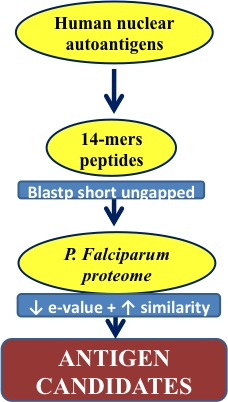
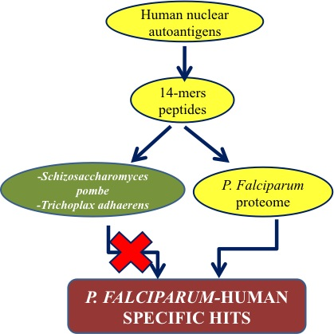

<a href="https://github.com/ELIXIR-ITA-training/python_course"> Back to Timetable</a>

***************
INTRODUCTION
***************
 
 

#### AUTOIMMUNITY AND PARASITE INFECTIONS
The immune system has evolved to effectively deal with infections. However, the co-evolution of
human hosts and parasites has led to mutual benefits in certain infections (Zaccone et al. 2008).

Autoimmune diseases (AID) arise from an abnormal immune response of the body against
substances and tissues normally present in the body (autoimmunity). Lupus and rheumatoid arthritis are
typical examples of AID. It was hypothesized that autoimmunity, in some cases, may be a side effect of
parasite-host mutual adaptation. Indeed, it has been observed that some individuals with AID show an
increased resistance to certain pathogen infections. The correlation between parasite infections and AID
may also be crucial to provide insights into host–parasite interactions, coevolution, potential novel
therapeutic approaches (Zaccone et al. 2008) or molecular mimicry (MM).

Different authors have observed a correlation between parasites, like helminthes, and the
development of autoimmune pathologies in animal models and humans (Zaccone et al. 2008), by
mechanisms like hyperproduction of TNF, regulatory auto-antibodies, interference with macrophage
activity, induction of Th2-skewed responses, but also the opposite effect, the induction of the autoimmune
pathology, by mechanisms as MM, polyclonal B cell activation, altered self antigens or production of
natural auto-antibodies by B1 cells (Zanini et al 2009).

#### THE RELATIONSHIP DISEASES BETWEEN MALARIA AND AUTOIMMUNE DISEASES

Malaria is caused by infection with the protozoan parasite Plasmodium. In humans, the most
severe form of malaria is caused by Plasmodium falciparum (Cowman and Crabb 2006), with more than
2,2 billion people exposed to the infection every year, and approximately 20% infections with possible
evolution to severe or lethal forms of the disease. Due to the development of immune response, inhabitants
of malaria-endemic countries present low levels of circulating malaria parasites and no clinical symptoms
and manifestations (Hommel et al. 2014).

Plasmodium falciparum is an endoparasite, which - in many stages - enters host cells. The
infection begins with the bite of a mosquito injecting the sporozoite form, which migrates to the liver and
invades hepatocytes. Here, it divides into thousands of merozoites, which invade erythrocytes (Cowman
and Crabb, 2006), producing clinical manifestations.

**Malaria and autoimmunity are frequently present together**, although the relationship between
them is poorly understood.

####  AIM OF THE STUDY
The aim of this study is the identification  of new potential  *P. falciparum* antigens
starting from a dataset of **11 human Nuclear Autoantigens (NAA) sequences** (stored in the file `nuclear_antigens.fasta`) known to stimulate a higher immune response in individuals from malaria endemic countries than in control UK population (Mangano et al., data not published).
In most of the cases, antigens have the form of short sequences, either because they are epitopes

**To achieve this aim we need to identify fragments of the 11 NAA with high similarity to subsequences of the *P. falciparum*  proteome.**

>Cowman AF, and Crabb BS. (2006) Invasion of red blood cells by malaria parasites. Cell 124(4):755-66 
>Hommel B, et al. (2014) Chronic malaria revealed by a new fluorescence pattern on the antinuclear autoantibodies test. PLoS One 9(2):e88548. doi: 10.1371/journal.pone.0088548 
>Zanini GM, et al. (2009) Sera of patients with systemic lupus erythematosus react with plasmodial antigens and can inhibit the in vitro growth of Plasmodium falciparum. Autoimmunity iFirst: 1–8 
>Zaccone P, Burton OT, and Cook A. (2008) Interplay of parasite-driven immune responses and autoimmunity. Trends Parasitol 24(1):35-42 

 
 

***************
HACKATHON TASKS
***************
 

The complete proteomes of P. falciparum and of two "control" organisms in FASTA format were
obtained form different sources: [PlasmoDB](www.plasmodb.org) for Plasmodium falciparum 3D7, [EBI-
EMBl](ftp://ftp.ebi.ac.uk/)  for Schizosaccharomyces pombe, and UniProt for Trichoplax adhaerens
(www.uniprot.org). Control organisms were chosen in order to have the following characteristics: 1) being
Eukaryotic 2) having genome size similar to that of P. falciparum 3) being non pathogenic to humans (no
need to evolve antigen mimics).

 
> Challenge #1 and Challenge #2 are independent. Choose one taking into account that  Challenge #2 is more difficult.
>
> look at [hints here](HINTS.md)
 

***************
### Challenge #1
***************

- From the file `nuclear_antigens.fasta` generate 14- amino acid long peptides (shifted by 1 position, use sliding windows). We chose as size 14 because that would be a reasonble size for antigens.
- Write them to a file in Fasta format. Remember to assign an ID to each of them in order to identify them later
- Search the 14-mers in the *P. falciparum* proteome (file `Plasmodium_falciparum.fasta`)
- Collect, for each peptide, the best scores in a table (use the option of having a tabular output from BLAST)
- Extract evalues and scores from the table
- Create a scatterplot of evalue and score
- Choose candidates among those hits with high score and low e-value

 
 

***************
### Challenge #2
***************

- From the file `nuclear_antigens.fasta` generate 14- amino acid long peptides (shifted by 1 position)
- Write them to a file in Fasta format. Remember to assign an ID to each of them in order to identify them later
- Search the 14-mers in the *P. falciparum* proteome (file `Plasmodium_falciparum.fasta`)
- Search the 14-mers in the *Schizosaccharomyces pombe* proteome (file `Schizosaccharomyces_pombe.fasta`)
- Create a table peptide_ID|score_plasm|score_pombe 
      set score_plasm = 0.0 if the peptide hasn't a match in the P. falciparum proteome  
      set score_pombe = 0.0 if the peptide hasn't a match in the S. pombe proteome 
- Create a scatter plot of evalues of *P. falciparuma* versus *S. pombe*  and a second scatter plot of scores of *P. falciparuma* versus *S. pombe*.
- Choose candidated among peptides with low evalues and high score that match in the P. *falciparum* proteome but not in the S. *pombe* proteome

 
 

***************
